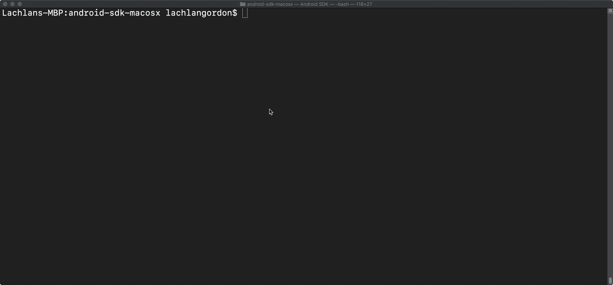

## Introduction

ADB, Android Debug Bridge, is a useful command line utility for interacting with Android devices for debugging and diagnostic purposes. Xamarin developers can use it to interact with their development devices to install/uninstall packages, inspect running apps, push and pull files and check error logs. 

## Accessing and using ADB on the command line

This article will assume you have Visual Studio 2019 for Mac or Visual Studio 2019 for Windows installed with the [Mobile development with .NET](https://docs.microsoft.com/en-us/xamarin/get-started/installation/windows) workload. We'll be accessing ADB from the SDK command prompt lunched from Visual Studio. If you want to run ADB on Linux, without Visual Studio or using the built in terminal additional configuration may be required but we won't cover that here. ADB can be downloaded as part of the [Android SKD Platform Tools](https://developer.android.com/studio/releases/platform-tools)

To access ADB:
 - Windows: Click Tools -> Android -> Android Adb Command Prompt...
 - Mac: Tools -> SDK Command Prompt

Once a terminal is open, type `adb` and hit enter. You should see a long list of instructions and commands. If you see a message saying `'adb' is not recognized...` or similar you will need to look into configuring your path or installing `adb`. 

## Overview of most useful commands

ADB is a very powerful tools with a lot of commands, we'll focus on a few of the most useful commands that you'll want to use when developing Xamarin Android apps.

### Devices
The first command you'll want to use is [Devices](https://developer.android.com/studio/command-line/adb#devicestatus). It displays a list of all Android devices that are currently connected. By passing in the `-l flag` it will give you more information to help you work out which device is which, instead of just showing a list of serials.

Most of the other commands in ADB will target one device at a time so if you have multiple devices connected you will have to pass this ID as an argument every time. I find it's generally easier to disconnect all but one device when I'm using ADB so it will automatically use the only device as the default.

### Install

To install an APK from your computer onto a device you can use the  [Install](https://developer.android.com/studio/command-line/adb#move) command. This is really useful for testing release buildings or 

To install a package you will need to pass it the file path of the APK.

e.g. `adb install /Users/lachlangordon/Downloads/com.lachlanwgordon.fifteenpercentdrop.apk`

### Uninstall

Removing an application using the Uninstall command removes the app from the device and all of the applications preferences and files. Removing an application using the Android UI can leave traces behind which can cause problems when installing. The adb uninstall command performs a thorough uninstall.

e.g. `adb uninstall com.lachlanwgordon.fifteenpercentdrop.apk`

### Shell
The `adb shell` command lets you interact with your device as you would any other computer including file browsing and executing commands. Android is essentially a Linus distribution so most of commands from a mac/Unix/Linux terminal can be used in the same way. Using shell you can access several utilities built into Android allowing you to capture screen shots, change settings, monitor activities inspect permissions and more.

For example `adb shell ls` will give you a list of files and folders.

### Activity Manager 
The Android Activity Manager is used to start/stop and pass data between activities using intents. It is accessed using the shell command e.g. `adb shell am` rather than being called directly as part of ADB. 

### Push/Pull

To transfer files to and from a device we use `adb push` and `adb pull`. These both require two parameters – the source and the destination.

e.g. `adb pull /sdcard/data.sql`

### Logcat

Logcat is the Android utility for recording error logs, stack traces, events etc. In it's simplest form, Logcat can be run by calling `adb logcat` with no options but this will give you and incredibly detailed log that can be hard to follow. There are lots of additional options to filter the logs to make it easier to digest. While it is a part of adb, the [Android Documentation](https://developer.android.com/studio/command-line/logcat) has a separate page for logcat as it can almost be considered an Android utility in its own right.

## Inspecting Devices

One of the main reasons to use ADB is to work out what's happening on your devices when things aren't going right. As .Net developers we're pretty lucky to have a fully featured debugger to help us solve a lot of problems but some issues appear outside of the debug cycle.

The first step to inspecting devices will be to use the `adb devices` command as mentioned above.

Running `adb devices` will give you a list of serial numbers. If you don't see any devices listed make sure your device is connected and has USB debugging enabled.

In the list we can see three entries but we can't tell much about them, we just see their serial numbers, which hint that one is an emulator but doesn't give anything else away.

By adding the -l (lower case L for list) we get a bit more info.

Now we can work out which serial matches my Pixel 3a and which matches my Samsung T510.

For most ADB commands you will only want to target one device. When multiple devices are connected this means passing the device serial in each command. To keep things simple I typically disconnect all but one device to avoid confusion and to prevent re-entering the serial every time.

Once we've got our device showing in adb we can view the output log of a running device using [Logcat](https://developer.android.com/studio/command-line/logcat)

Logcat outputs the logs from a device to gain insight into what's happening. This is particularly useful for debugging issues that only appear in release/production builds of your Android app. 

The default use of the command `adb logcat` will display everything in the terminal, updating live. This will all fly past so quickly that it will be hard to make any sense of it, but it is interesting to see just how active the android system is even when you're not actively using an app.

e.g. `adb logcat`

The output of logcat is much easier to digest if you store it in a file. The quickest way to do this is to add `>` and a file name. Once logcat has run you can then open in your text editor of choice to search at scroll at your leisure.

While logcat is running you may want to try launching your app, or performing what ever action you're trying to debug. When you're ready press ctrl+c to stop logging and you can open the file.

E.g. `adb logcat > myFile.log`

The output of logcat can also be accessed in Visual Studio by opening the Device Log Pad. This makes it easy to choose which device you want to watch from a drop down menu and offers filtering options. The device logs tab also shows iOS device logs which aren't access via ADB and would otherwise require you to use Xcode.
5.1

## Managing Applications

Managing applications installed on an Android can usually be managed from the Android UI, with your apps deployed for debugging using the IDE. There are a few advanced situations where using ADB can give you more options or get you out of a tight spot.

### Installing
The main reason I tend to use adb install is if I have a release build that I want to test before uploading to the Google Play Store. It's such a pain when you get rejected from the store because the app crashes on launch and they don't accept "the debug build works on my phone" as an excuse

e.g. `adb install /my/package.apk`

 ### Uninstall
 If you're having problems with Visual Studio installing a new build to your device, even if you've deleted it, the uninstall command is the easiest way to make sure the app in completely gone

e.g. `adb uninstall com.mycompany.mypackagename,`

### List of install packages
If you want a list all packages installed on your device, the `pm` (package manager) command, run using shell is the way to go.

There are various flags you can pass to pm to get it to behave differently but the easiest way to get a useful out put is to run ` adb shell 'pm list packages -f'`. If you want to read a little more about other uses, there's a useful [gist by David Nunez](https://gist.github.com/davidnunez/1404789) with lots of good comments on it.

### Run-as

@matthew can you give an example of this, I'm not quite sure how to use this.

 * adb shell + run-as -> Start a shell session on the device and explore it's file system. Use run-as to change the shell sessions user to your app (all apps run as distinct linux users in Android) so that you can explore its bundle. EG: Use `cat` to print the contents of a the shared preferences file to the terminal output.

### Copying files to and from a device

One of the useful features of ADB is the ability to transfer files using the pull and push commands. While there are various other ways to access these files, ADB makes it fast and repeatable, whereas accessing storage through finder/explorer will be slightly different depending on device manufacturer and version.

One situation where this can be useful is if you use a SQLite database in your app and you want to transfer the database file to you desktop to inspect the contents.

Copying files is covered in the docs at [https://developer.android.com/studio/command-line/adb#copyfiles](https://developer.android.com/studio/command-line/adb#copyfiles).

#### Pull
Pull is used to transfer a file from your device to the computer.

e.g.
`adb pull sdcard/data.csv data.csv`

#### Push
Similarly push is used to get transfer a file from your computer to your device.

e.g.
`adb push data.csv sdcard/data.csv`

## Summary

ADB let's you take control of you Android device and see what's going on inside. As its name suggests, it's a really useful tool for debugging your apps, especially in the edge cases outside of normal business logic debugging and when approaching a release.

## Resources
* [ADB Documentation](https://developer.android.com/studio/command-line/adb/)
* [Android Wi-Fi Debugging with ADB and Xamarin Visual Studio](https://www.andrewhoefling.com/Blog/Post/android-wi-fi-debugging-with-adb-android-device-bridge-and-xamarin-visual-studio) by Andrew Hoefling