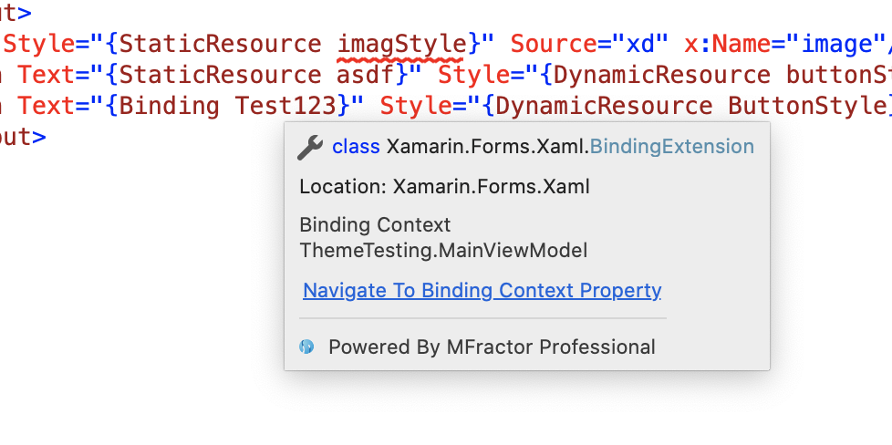
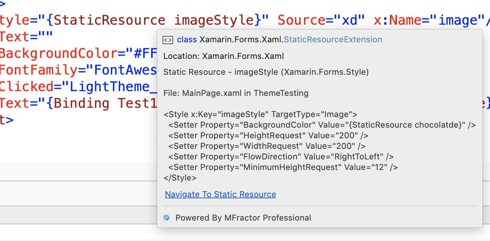
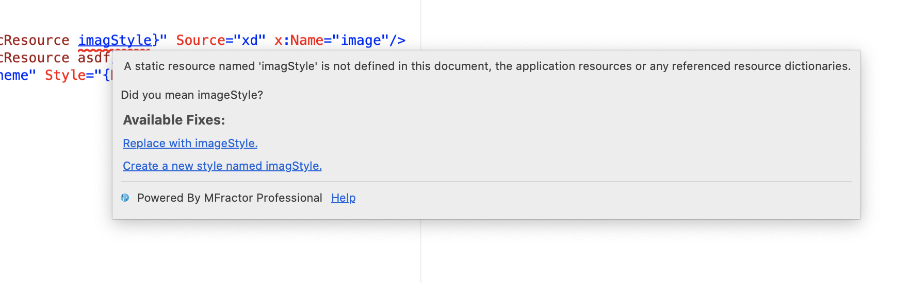
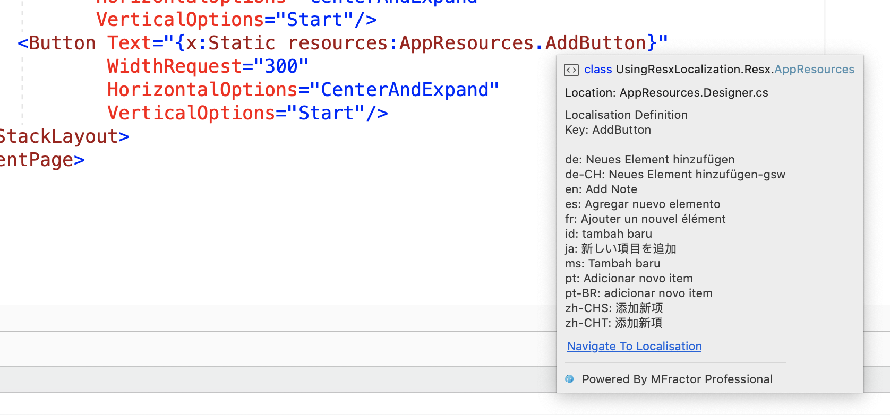
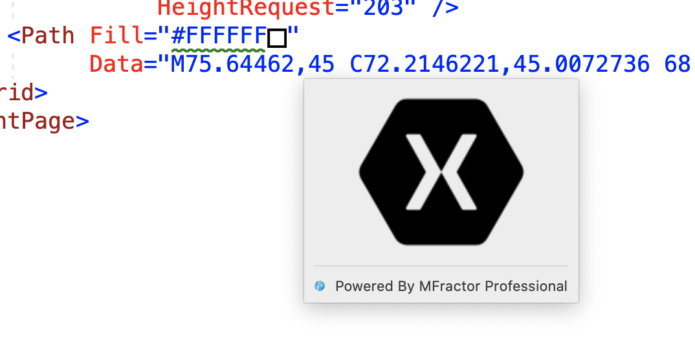
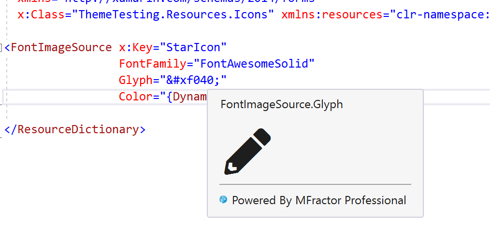
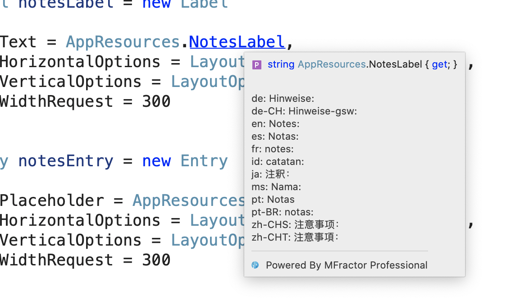
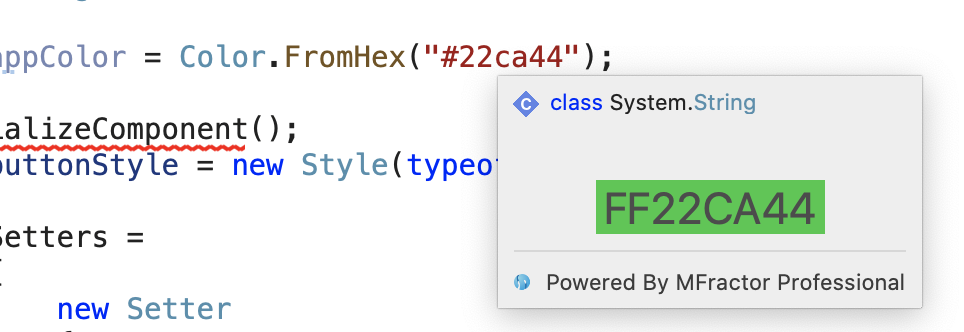
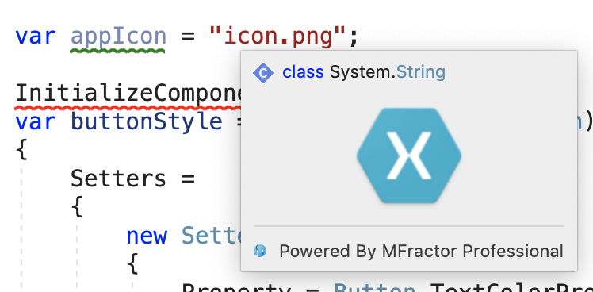
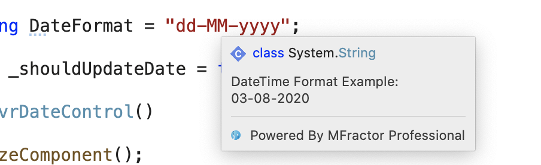

Today I'm pleased to announce the release of MFractor 4.3 for Visual Studio Windows and Mac.

This release provides support for Visual Studio Mac 8.7 and includes many tooltip features for both XAML and C#. In 4.3, my goal is to surface useful additional information about your code and to improve the navigation experience in MFractor.

Let's dive into this release.

## Navigation Links

MFractor has long included a XAML navigation engine that provides navigation support for data bindings, static and dynamic resources, localisation values and much much more.

To help you discover these navigation shortcuts, MFractor now includes "navigation links" inside its tooltips when availble.

For example, if you hover over a binding expression, you can use the **Navigate To Binding Context Property** link to jump to the referenced property on the view model:

Or, hover over a static resource and use the **Navigate To Static Resource** link to jump to the static resource declaration:

To perform the navigation, click on the the link and MFractor will take you to the symbol.

Navigation link tooltips are available in both Visual Studio Windows and Mac.

## Integrated Help Links

MFractor includes almost 100 XAML analysers to spot a wide variety of bugs and code issues. To make it easier to understand the error that MFractor is reporting, our  analysis tooltips now include a help link to that analysers documentation:

## XAML Tooltips

In addition to navigation and help links, 4.3 adds several new XAML tooltips. Here are the new tooltips...

Hover over a localisation lookup via a RESX design class to view a summary of the localisations for that key:

Hover over an SVG path to see a preview of that path rendered:

Lastly, for our Visual Studio Windows users, we've added font tooltips to help let you preview a font directly within the XAML editor.

Hover over a string where a `FontFamily` is defined for the XAML element and MFractor will render a preview of that string:

## C# Tooltips

This release also adds several useful tooltips to the C# editor, helping you visualise localisations, colors, images and dates.

Hover over a localisation lookup via a RESX design class to view a summary of the localisations for that key:

Hover over a hex value defined in a string to see a preview of that color:

Hover over an image reference in a string to see a preview of that image asset:

Lastly, hover over a string that is a valid date time format to see a preview of that format:

## Summary

MFractor 4.3 makes it easier to navigate your code with navigation links and surfaces tonnes of additional information through a variety of new tooltips.

In addition to these new feaures, Raf and I have put a lot of work into improving the performance of the product and fixing many, many customer reported issues in MFractor for Visual Studio Windows.

🤙
Matthew Robbins - Founder of www.mfractor.com
