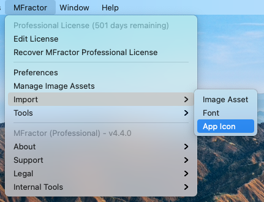
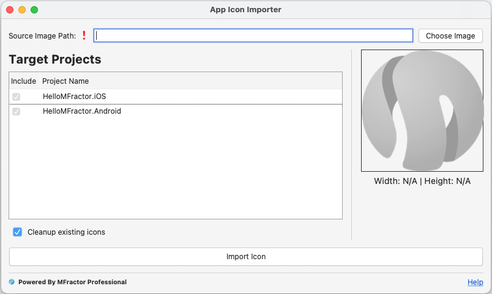

Today I'm pleased to announce the release of MFractor 4.4 for Visual Studio Windows and Mac.

This release provides support Visual Studio for Windows 16.8, Visual Studio for Mac 8.8, and includes a very requested feature, the Application Icon Importer. 

## The App Icon Importer

Application icons (or launcher icons in Android) are a minimum requirement for publishing your app in the store. They are the gateway for your open on the crowded home screens of the users, and a important part of your visual identity. Despite being a basic requirement, it's always been painful to import those icons, specially for iOS projects, given the wide range of icon sizes and densities that must be met for the app to be accepted on the store.

It's true that are some standalone applications and sites that aids on generating those required images, but still they don't play well along Xamarin projects. It's not uncommon to have issues with references in the project file when trying to copy or drag those generated images over, which most of the times are painful to identify.

Enters the MFractor App Icon Importer feature! Inspired by the popular [Image Importer]() feature, that allows you to easily add images to your projects, the App Icon Importer introduces the same ease when adding application icons. The new feature is available on the MFractor top menu:

Which will trigger a brand new dialog for importing your icon:

The App Icon Importer was designed to be the more straighforward it could. This is the reason behind the simplified UI, where we ommited complex lists of images and densities that would be imported and assumed common conventions. We are aware that some users may need a more extensive option toolset, but we found that for the most part a simple and straight importer fits the needs.

So how does it works? You just need to select the source image and check the projects to which you want the importer to do its trick. It's simple as that! Although simple, you should take note of a few requirements for the source image:

* It should be a square image, which means that it must have the same width and height. This is the aspect ratio of all the icons in both supported platforms (iOS and Android) and we've chosen to not resize images to fit this aspect ratio to avoid stretching or squizing the image in inexpected and undesired ways.
* Its recommended that the image have at least 1024x1024, which is the size of the major image added by the importer (the App Store marketing image on iOS). This also ensures that the icon will preserve its quality when the image is downsized to all the sizes. It's still possible to import an smaller image, but notice that it may be upscaled and lose its quality.

By having an image that follows the above requirements you should be good to go with the importer. Just browse to the desired source and click on the import icon.

### Cleaning Previous Icons

Built-in to the App Icon Importer is the open to cleanup existing icons. By checking this mark MFractor will scan for any previous images on the conventional 

### Further Improvements

We're aware that this first installment of the App Icon Importer may be missing some advanced features that users should require. Considering MFractor mission to bring the most powerful tools to developers we are already on the specs for further improvements on this valuable tool, like the [_Launcher Icon Importer_](https://github.com/mfractor/mfractor-feedback/issues/300), to bring an enhanced version capable of dealing with the specifics of the [Android Adaptative Icons](https://developer.android.com/guide/practices/ui_guidelines/icon_design_adaptive).

We're also considering more granular options, like watchOS app icon support, selecting the destination Asset Catalog for the iOS icon, or changing the base name for images to be imported. Please use our feedback to let us know if any of those additions would fit your needs so we can consider and prioritize enhancements for the next versions.

## Summary

MFractor 4.4 is a major release that brings an important and long time requested feature. We've also put a lot of effort on refactorings and improvements on our code base to make the product more stable and laying the ground for more exciting features that will hit on the long-term, like support for MAIU projects.

Update now and stay tuned to more compelling features and enhancements that we're preparing on the next few months. And as awalys, feel free to [keep in touch](https://twitter.com/mfractor?lang=en) and leave [your feedback](https://github.com/mfractor/mfractor-feedback).

🤙
Matthew Robbins - Founder of www.mfractor.com