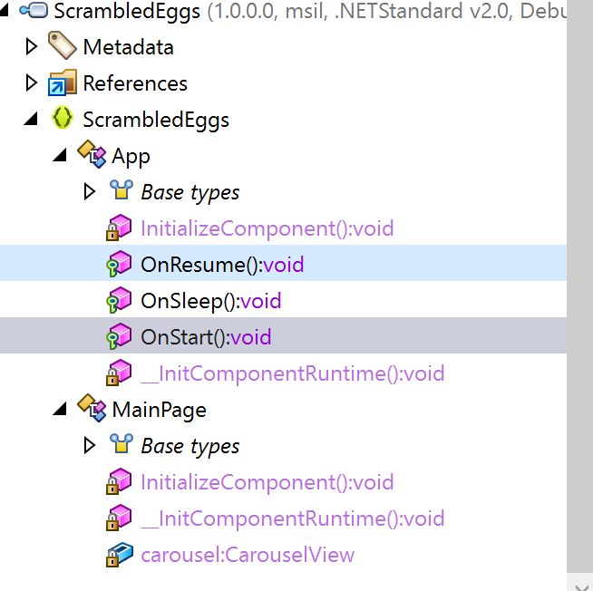

## Introduction


https://www.preemptive.com/products/dotfuscator/overview

This article covers how to setup Dotfuscator on your Mac, how to integrate it into your app and what the end-result looks like.

## The Benefits Of Obfuscation

One of the benefits of .NETs Intermeddiate Language (IL) is also one of its drawbacks;

Obfuscation is the process of taking code and "scrambling" it to a

When we compile a

## Install Dotfuscator Build Tools

Download the nuget package from dotFuscator:
* https://www.preemptive.com/dotfuscator/pro/userguide/en/installation_mac_linux.html

Change the nuget file extension to .zip and extract to a directory named dotfuscator in the users home directory.

## Configure Dotfuscator Settings

Create a new file named .dotfuscator.user.props in your home directory. (Open console and type cd ~ then touch .dotfuscator.user.props).

Add the following content to the .dotfuscator.user.props file:

```
<!-- This is an MSBuild properties file for projects which use Dotfuscator's MSBuild components.
     For details, see <https://www.preemptive.com/dotfuscator/pro/userguide/en/interfaces_msbuild.html#user>.
-->
<Project xmlns="http://schemas.microsoft.com/developer/msbuild/2003">
    <PropertyGroup>
        <!-- Path where Dotfuscator's MSBuild components are installed via the NuGet package. -->
        <DotfuscatorMSBuildDir>/Users/matthewrobbins/dotfuscator/tools/msbuilddir</DotfuscatorMSBuildDir>

        <!-- License string for Dotfuscator. -->
        <DotfuscatorLicense>License key here</DotfuscatorLicense>
    </PropertyGroup>
</Project>
```

Replace the `$license_key$` placholder with your license key and update the DotfuscatorMSBuildDir to point to the dotfuscator directory in your home directory. This configure

## Install Dotfuscator Nuget Package

Add the local nuget package to all your projects by creating a folder named nuget in your repository, adding the dotfuscator nuget package to this folder and then adding the following element to the Android and iOS projects msbuild content:

```
<PackageReference Include="..\nuget\PreEmptive.Protection.Dotfuscator.Pro.Eval.6.0.1.nupkg" />
```

This will install the nuget package from a relative file path into your project.

## Integrate Dotfuscator Into Your App

Finally, to activate Dotfuscator in your builds, add the following content to the end of your Android and iOS projects:

```
    <!-- Import environment-specific build properties for Dotfuscator, if they exist. -->
  <Import Project="$([System.Environment]::GetFolderPath(SpecialFolder.UserProfile))\.dotfuscator.user.props" Condition="Exists('$([System.Environment]::GetFolderPath(SpecialFolder.UserProfile))\.dotfuscator.user.props')" />

  <!-- Set build properties for Dotfuscator. -->
  <PropertyGroup>

    <!-- Generate a default Dotfuscator config file (DotfuscatorConfig.xml) if it doesn't exist. -->
    <DotfuscatorGenerateConfigFileIfMissing>true</DotfuscatorGenerateConfigFileIfMissing>

    <!-- Enable Dotfuscator for Release builds. -->
    <DotfuscatorEnabled Condition="'$(Configuration)' == 'Debug'">true</DotfuscatorEnabled>

    <!-- Enable Dotfuscator for Release builds. -->
    <DotfuscatorEnabled Condition="'$(Configuration)' == 'Release'">true</DotfuscatorEnabled>

    <!-- Enable Dotfuscator for Ad-Hoc builds (only needed for iOS). -->
    <DotfuscatorEnabled Condition="'$(Configuration)' == 'Ad-Hoc'">true</DotfuscatorEnabled>

    <!-- Enable Dotfuscator for AppStore builds (only needed for iOS). -->
    <DotfuscatorEnabled Condition="'$(Configuration)' == 'AppStore'">true</DotfuscatorEnabled>

    <!-- Only needed when using Tamper Checks for Android. -->
    <!-- TODO: If using Tamper Checks for Android, set this to the SHA-1 fingerprint of the certificate used to sign the app. -->
    <DotfuscatorAndroidSigningCertFingerprint></DotfuscatorAndroidSigningCertFingerprint>

  </PropertyGroup>

  <!-- Import the Dotfuscator MSBuild targets. Must be done last. -->
  <Import Project="$(DotfuscatorMSBuildDir)\PreEmptive.Dotfuscator.Common.targets" />
```

## Obfuscation Result




Findings:

 * Inner logic of methods is

## Customising Obfuscation

 * Overview of config file
 * Using the config file editor on Windows.

 * Excluding types/namespaces from control flow obfuscation.
 * Excluding types/namespaces from type

## Summary

https://www.preemptive.com/dotfuscator/pro/userguide/en/getting_started_xamarin.html
