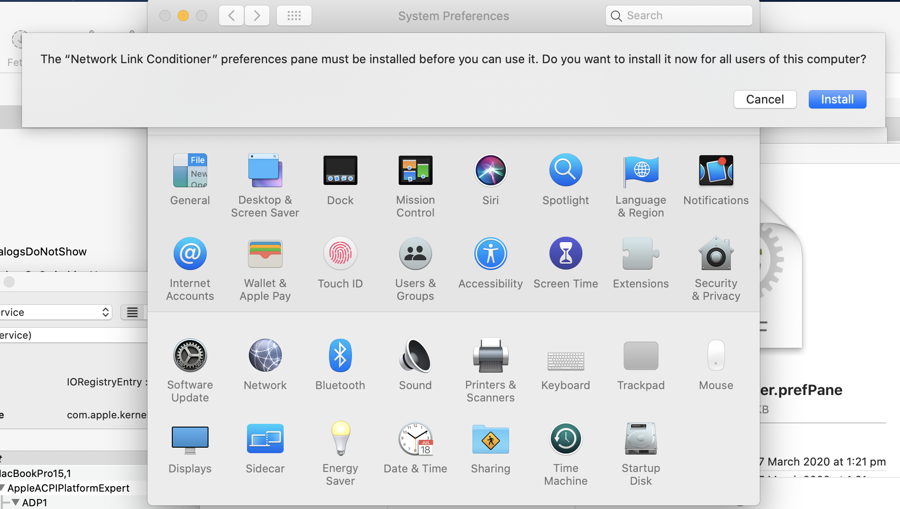
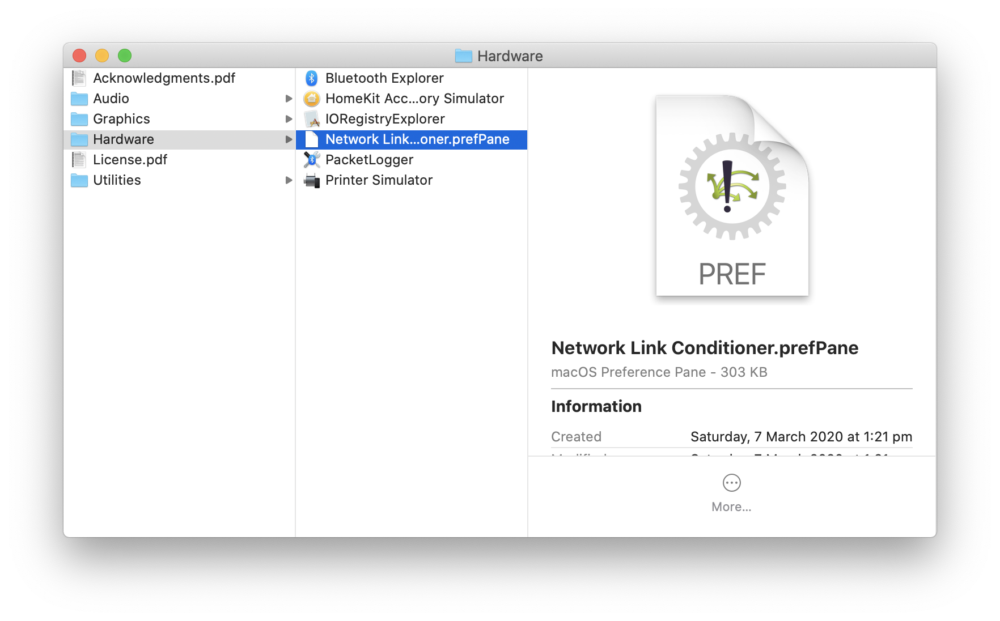

## Introduction

Tools:

Network link conditioner: A apple developer tool that can be used to apply constrain network bandwidth, add latency and introduce packet loss.

Why: Our users do not always have perfect network connections.

The app should fail gracefully and still perform without locking up the UI or rendering the app unusable.

Testing on poor network con

Some examples of where network resilence is needed:

 * Workers who travel through regional areas.
 * Mining situations where network strength might be unavailable or severally limited (EG: Underground).

## Setup And Installation

Three steps:

 * Download and install the network link conditioner from Apples additional developer Tools
 * Setup our Mac to be a WiFi hotspot so that our other devices can route through the conditioned network.

### Download Additional Developer Tools

### Install Network Link Conditioner

### Configure Mac As Wireless Hotspot

To use the network link conditioner to test actual devices, we need to convert our Mac into a wireless hotspot.

As MacOS cannot connect to both a WiFi network and run as a WiFi hotspot, we need to connect to the internet through alternative means:

 1. Use a wired network connection.
 2. Use an iPhone as a tethered connection over USB.

TODO: Summarise the following article

https://www.howtogeek.com/214053/how-to-turn-your-mac-into-a-wi-fi-hotspot

### Connect Android Devices

## Using The Network Link Conditioner

Main settings:

**Downlink**

TODO: Overiew of the bandwidth, packets dropped and delay settings.

**Uplink**

### Applying Network Conditioning Profiles

### Creating Custom Profiles

## Summary

TODO: Why is this technique use

![]
