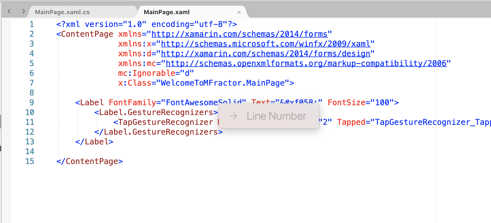
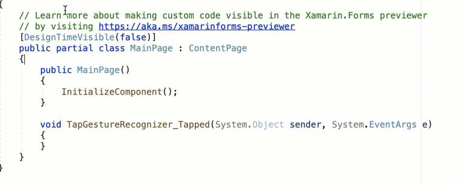
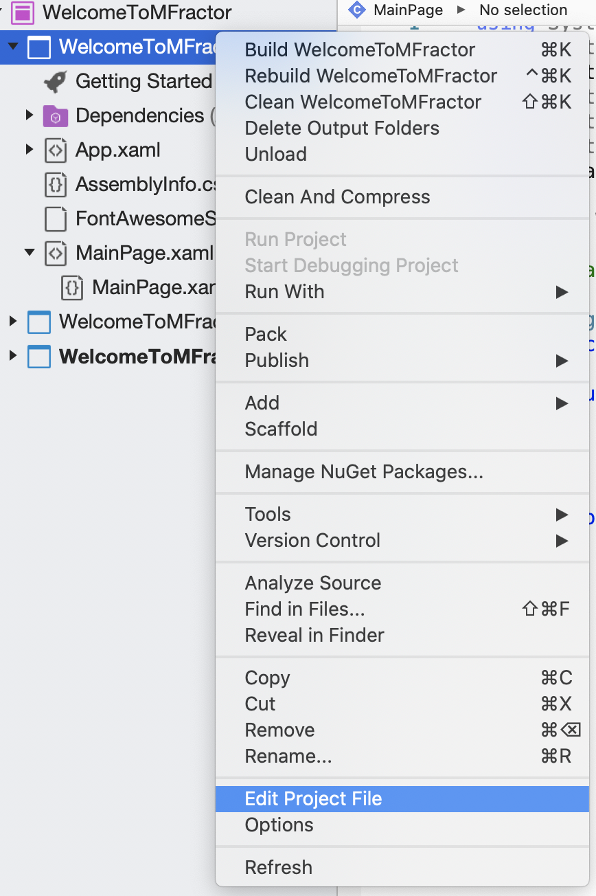
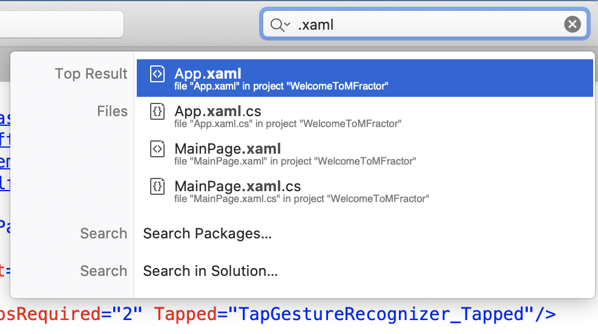
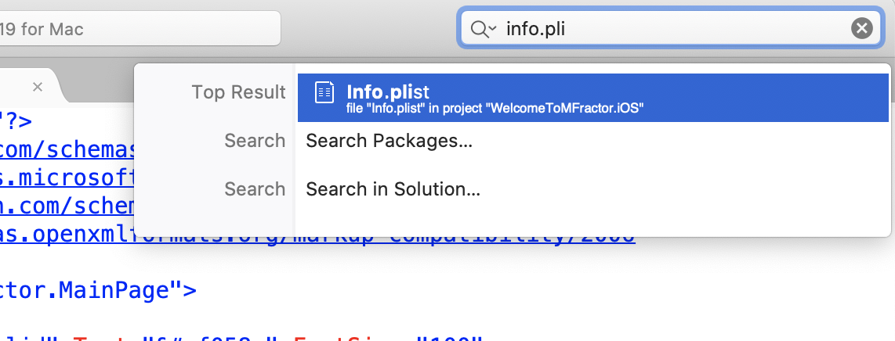
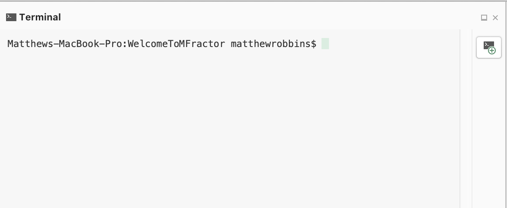

## Introduction
Visual Studio for Mac is my one true love when it comes to IDEs. I use others now and then, and there's some great stuff out there, but VS Mac is where I feel at home. Even though I've been using VS Mac for years, every now and then I discover an awesome feature hiding behind a hotkey. Today I'll show you my five favourites.

## Go to Line – `Command + L`
Up first is Go To Line. Don't worry, I'm not talking about the much maligned statement from programming's past. This is a nifty hot key to let you jump around a file super quickly without having to reach for the mouse.

To use it, press `Command + L`, type in a number, hit enter, and you're done.

I don't always know exactly what line I need to go to but I often have a bit of an idea like "My OnDisappearing is right down the bottom, 300 will do" or "I need some usings, this is an easy one, line 1".

## Go To Matching Brace – `Command + Shift + \`
Have you ever worked with some messy code where you've got 3 levels of nested `if`s and a `foreach` around it inside an inner class wrapped up in a lambda? And you just can't figure out where your brace ends after scrolling down 200 lines?

No, me neither, of course all my code is beautiful, but let's just say I did have a some files like that.

Put you caret next to an open `{` or close `}`, you'll see that the brace is highlighted in a light grey. If your file is short enough/your screen is tall enough you'll be able to see the matching closing brace is highlighted to match. Whether it's on screen or not, press `Command + Shift + \` and the caret will jump the the matching brace.

## Edit Project File – `Right click on project and Edit Project File`
Sometimes we need to open our project files (.csproj), maybe to change some Nuget versions or tinker with some hidden configurations. You used to have to go out to the finder and dig around to open it in a text editor, and even once you found it, `.csproj`s were scary and editing a live file could get weird.

Project files are getting simpler and IDEs are getting smarter. XML is fun again! Right click the project and click `Edit Project File` and you're up and running.

## Global Search – `Command + .`
This one is my favourite, and I've only started using it to it's full potential very recently. Press `Command + .` or click in the search at the top right and your in the Global Search. It may seem like just a little search box, but it's surprisingly powerful.

Global search allows you to search for files, classes, methods, IDE features, Nuget packages, or any other string in your solution.

To use it, press `Command + .` and start typing. There's a pretty good chance it will find what you're looking for and suggest it as the top result or not far below. If not the select `Search in Solution...` and it will find all result and show them in the Search Results pad.

### Search Files
By typing in ".xaml" it finds my `App.xaml` as the first result and then suggests other xaml files.

When looking for the `Info.plist` it finds it before I can finish typing the name.

A great way to use the search is to double highlight some text in a file and press `Command + .` and it will search for the string, no need to copy and paste. 

### Search Commands
You can also use the global search to find IDE Commands. This is great for all the features that you know are in a menu somewhere but can't find, or if you just don't want to mouse your way through them.

A few of my favourite searchable commands are:
* Reopen closed tab – start typing "reopen"
* MFractor MVVM Wizard – start typing "MVVM"
* Reveal in Finder – start typing "Finder"

If it's a menu item, you can probably open it by searching for the command. 

## Open Integrated Terminal – `Control + Shift + ~`
One of the newest features in VS Mac is the Integrated Terminal, and with the new feature, a new hotkey to open it up. Just hit `Control + Shift + ~`, or if you're more of a mouse oriented user click `View > Pads > Terminal`.

It makes me happy that I no longer have to leave the IDE to run terminal commands for Git, Entity Framework scaffolding, ADB etc. Until now we haven't seen much going on in the terminal for Xamarin projects but it is used a lot in .NET Core and we can expect to see `dotnet` commands available for us when MAUI is released.

## Summary
The features we've looked at here help you get things done faster in Visual Studio for Mac. This not only helps by saving time but helps you stay focused by not having to dig through folders, menus, long files and opening up external tools.

## About The Author
Lachlan is a freelance Xamarin developer who has recently been branching out into Blazor. As a co-organizer of the [Blazor and Xamarin Meetup](https://www.meetup.com/Melbourne-Xamarin-Meetup/) he regularly presents on whatever his latest .Net adventure has been. When not writing C# you'll usually find him riding a bike or playing double bass. 

You can find him on Twitter
[@lachlanwgordon](https://twitter.com/lachlanwgordon), Github [github.com/lachlanwgordon](https://github.com/lachlanwgordon), LinkedIn [linkedin.com/in/lachlanwgordon](https://www.linkedin.com/in/lachlanwgordon), live coding at [twitch.tv/lachlanwgordon](https://twitch.tv/lachlanwgordon) and blogging on [lachlanwgordon.com](https://lachlanwgordon.com).