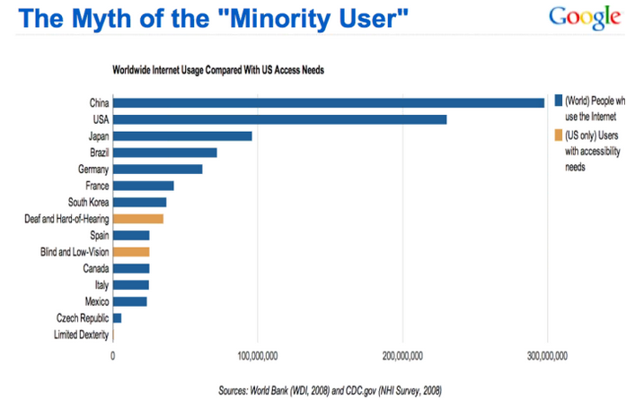

In the last American census, it was estimated that 18.7% of the
population has some type of disability and of those, according to the
Pew Internet Project, 54% utilize internet connected services and
devices. In other words, the consumers of our web and mobile
applications who have disabilities, in some cases, outnumber the total
users in countries like South Korea, Mexico and Spain (Accessibility,
Interactive).

In Xamarin.Forms (XF) we can create compelling and interactive mobile
applications as well as accommodate the needs of our users that have
certain disabilities. Before delving into the accessibility features of
XF and the code needed to activate a feature, lets address design
guidelines that are equally if not more important.

1.  Layout elements on the screen with navigation in mind: Make sure
    navigating between controls using alternative inputs methods matches
    the logical flow using a touch screen.

2.  Support appropriate fonts and color contrasts: Avoid hard-coded
    dimensions so that layouts can resize to accommodate larger fonts.
    Also pick colors that are still readable in high-contrast mode.

3.  Provided multiple user cues: Provide visual indicators and not just
    sound or color changes for completion events. When colors are used,
    pick a palette that is easy to distinguish changes for those with
    color blindness.

4.  Provided captioning for various types of media: All video and audio
    media should have captioning and readable scripts.

The second part of design process includes utilizing features of the OS.

1.  Select visual elements to be seen by accessibility features of the
    OS. Also exclude those elements not needed for a particular
    workflow.

    -   XAML

> \<Entry AutomationProperties.IsInAccessibleTree=\"true\" /\>

-   Code

> var entry = new Entry();
>
> AutomationProperties.SetIsInAccessibleTree(entry, true);

2.  User Interface is self-describing: Make sure all elements have
    descriptive text and hints compatible with screen reading APIs. All
    Images should have alternate text.

    -   XAML

        -   Name

> \<ActivityIndicator AutomationProperties.IsInAccessibleTree=\"true\"

AutomationProperties.Name=\"Progress indicator\" /\>

-   Help Text

> \<Button Text=\"Toggle ActivityIndicator\"
>
> AutomationProperties.IsInAccessibleTree=\"true\"
>
> AutomationProperties.HelpText=\"Tap to toggle the activity indicator\"
> /\>

-   Code

    -   Name

> var activityIndicator = new ActivityIndicator();
>
> AutomationProperties.SetIsInAccessibleTree(activityIndicator, true);
>
> AutomationProperties.SetName(activityIndicator, \"Progress
> indicator\");

-   Help Text

> var button = new Button { Text = \"Toggle ActivityIndicator\" };
>
> AutomationProperties.SetIsInAccessibleTree(button, true);
>
> AutomationProperties.SetHelpText(button, \"Tap to toggle the activity
> indicator\");

3.  Accessibility for Navigation:

    -   On Navigation pages, for Android, set the
        AutomationProperties.Name & AutomationProperties.HelpText in
        order to enable the back button to be screen readable. (Does not
        work for iOS)

    -   On MasterDetail pages, for iOS, follow the above example to
        enable screen reading of the toggle button. For Android, set the
        page's IconImageSource's AutomationId to a descriptive text.

    -   On ToolbarItems, for both platforms, use the
        AutomationProperties.Name & AutomationProperties.HelpText to set
        screen readable text.

4.  Layout Order: The tab order of visual elements is in the order in
    which they are placed on the screen. However, this may not be the
    order most logical for accessibility. Also, some controls should be
    skipped in tabbing. In the following example, entry fields are
    placed in in columns and rows resulting in the following:

However, the order should be vertical and then horizontal. Setting a
controls tab index can change this to the following:

We can also skip / exclude controls from tabbing by setting the property
`IsTabStop` to `false`.

Now that you have enabled and set the name, help text and tab order for
various controls, it is time to test these features.

**iOS Testing Procedure:**

Apple has a lot of helpful tools to assist developers with integrating
accessibility into the applications they build. Before we get started
with VoiceOver, it's important to become familiar with the Accessibility
Inspector. The Accessibility Inspector is a tool that shows all of the
properties and values, methods (actions that can occur from elements on
the screen), and position of the object that's currently being selected
on the screen.

To start the Accessibility Inspector follow the simple steps below:

1.  Bring up Xcode.

2.  Navigate to the Open Developer Tool and start the Accessibility
    Inspector.

3.  Bring up the simulator running with the application you would like
    to inspect.

The Accessibility Inspector can connect to a lot of different processes.
While navigating with the inspector you can click by clicking on things
twice. If you want to activate a tab with the Accessibility Inspector
click on it once. The following tutorial will guide you through the
testing steps and features of this tool.

-   https://www.youtube.com/watch?time\_continue=1&v=EkG5\_kWkqwE&feature=emb\_logo

As mentioned above, the inspector tool uses VoiceOver to give auditory
prompts to the user. The following Apple documentation explains this
feature and how to activate it on a real device in order to perform
manual testing.

-   <https://developer.apple.com/library/archive/technotes/TestingAccessibilityOfiOSApps/TestAccessibilityonYourDevicewithVoiceOver/TestAccessibilityonYourDevicewithVoiceOver.html>

**Android Testing Procedure**

Google's accessibility team has created a tool called [Accessibility
Scanner](https://play.google.com/store/apps/details?id=com.google.android.apps.accessibility.auditor).
This app is free to download and is the easiest way to quickly find
issues with your application's accessibility.

Once the scanner is running, open up the application you'd like to test,
and tap the floating blue circle. This will scan the current screen and
display an orange box around potential accessibility issues. Tapping on
the orange box displays a summary about that specific issue, and even a
link to detailed documentation about how to fix it.

The following links provide documentation and tutorials on Android's
accessibility scanner.

-   <https://support.google.com/accessibility/android/answer/6376570?hl=en>

-   <https://medium.com/@cor.johnson/android-accessibility-scanner-9a0b2a2f304b>

In addition to the scanner tool, it is important to manually test your
application using the built-in features of the Android device. The
following tutorial and documentation will help you perform manual
testing.

-   <https://www.youtube.com/watch?v=6dq_Vt5R6e4>

-   <https://developer.android.com/guide/topics/ui/accessibility/testing#how-to>

The code snippets provided in this article are informative, but a real
example is far more helpful. Here is example of accessibility enabled
using Xamarin.Forms.

> <https://docs.microsoft.com/en-us/samples/xamarin/xamarin-forms-samples/userinterface-accessibility/>

Citations

Accessibility, Interactive. "Accessibility Statistics." *Accessibility
Statistics \| Interactive Accessibility*,
www.interactiveaccessibility.com/accessibility-statistics.
