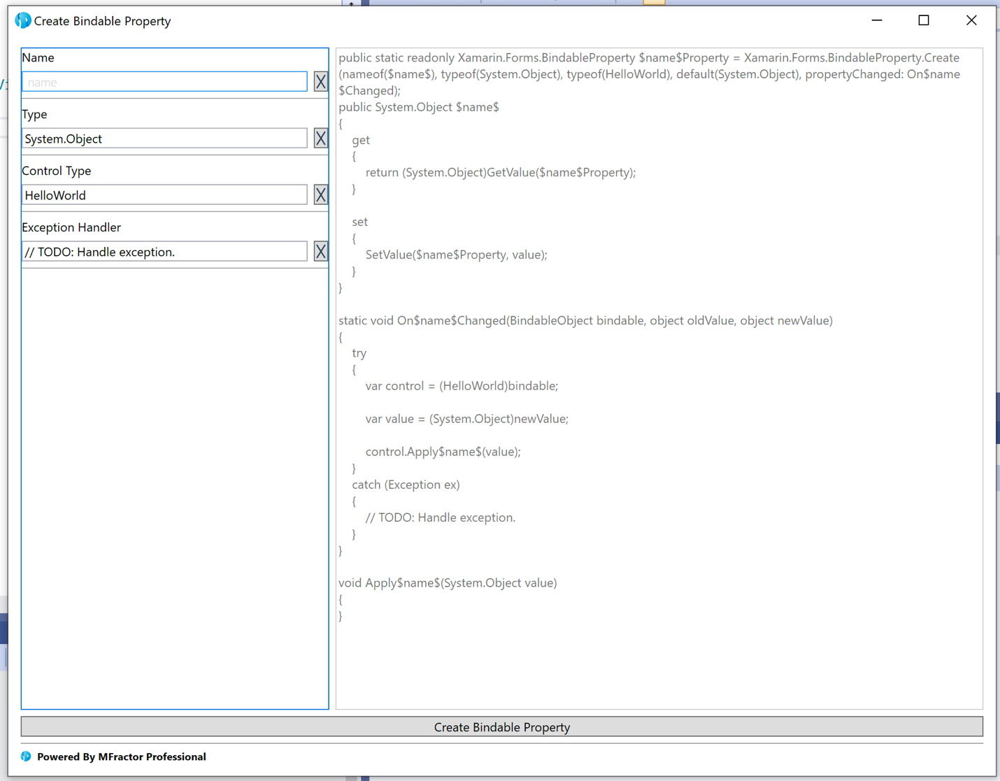

**Using Bindable Properties In Xamarin.Forms**

I would argue the nicest feature of Xamarin is the ability to create custom controls natively or simply extend existing ones. If you have tried other mobile frameworks, you will notice quickly that you are limited to what they provide and making only composite controls. They real power isn't just that you can create visually stunning UIs but that through bindable properties your component can interact at runtime with the backend code making it as powerful as those provided out of the box.

Before we get into a practical example, let's explain the basic concepts of a bindable property. They provide the following abilities:

- Can set a default value
- Can monitor changes in a value
- Can validate a value
- Can set a value via a style
- Enable data binding

The process of creating a bindable property starts with the Create method of the BindableProperty class.

```
public static readonly BindableProperty TextProperty = BindableProperty.Create(nameof(Text), typeof(string), typeof(ImageTextButton), default(string), propertyChanged: OnTextChanged);
```

As you can see, we have defined a TextProperty. The parameters are
defined as such:

-  `nameof(Text)` is the class property it is associated to
-   `typeof(string)` is the data type of the property
-   `typeof(ImageTextButton)` is type the property is a member of
-   `default(string)` is the default value it should be set to initially
-   `propertyChanged` is the method that should be called when data
    binding occurs

The remaining hookup code referenced in the above create parameters is:

```
public string Text
{
  get => (string)GetValue(TextProperty);
  set => SetValue(TextProperty, value);
}

private static void OnTextChanged(BindableObject bindable, object oldValue, object newValue)
{
  var control = (ImageTextButton)bindable;

  var value = (string)newValue;

  //You can do anything you want here
}
```

So, let's give you a simple scenario where using bindable properties would be useful. Let's make a composite control that is a button with Text and an Image. This isn't that hard because we already have controls for labels, images and containers. We just need to position the items correctly and hookup a tap event. The following is the code and what it looks like.

```
public class PageOne : ContentPage
{
    public PageOne()
    {
        this.Title = "PageOne";

        var tapGesture = new TapGestureRecognizer()
        {
            Command = new Command(async () =>
            {
                await Navigation.PushAsync(new PageTwo());
            })
        };

        var compositeControl = new StackLayout()
        {
            BackgroundColor = Color.LightGray,
            HeightRequest = 45,
            Margin = new Thickness(150, 100, 150, 100),
            Children =
            {
                new StackLayout()
                {
                    Margin = 8,
                    HorizontalOptions = LayoutOptions.Center,
                    Orientation = StackOrientation.Horizontal,
                    Children =
                    {
                        new Image()
                        {
                            Margin=new Thickness(10,5,0,5),
                            Source = ImageSource.FromFile("music.png"),
                            HeightRequest = 22,
                        },

                        new Label()
                        {
                            Margin=new Thickness(0,5,10,5),
                            Text = "Click Here",
                            TextColor = Color.Black,
                            VerticalTextAlignment = TextAlignment.Center,
                        }
                    }
                }
            }
        };

        compositeControl.GestureRecognizers.Add(tapGesture);

        Content = new StackLayout()
        {
            Children =
            {
                compositeControl
            }
        };
    }
}
```


This works fine but not really reusable and all the properties are hard-coded. It would be nice to move this into a separate content view with bindable properties. This wouldn't be that difficult and all you would need to do is make properties for the image, label and click command. Simply copy and paste the property creation code above over and over again and remember to change the parameters to the appropriate values. However, there is an easier way!

MFractor has a [bindable property wizard](https://docs.mfractor.com/xamarin-forms/custom-controls/bindable-property-wizard/) that makes creating these properties ridiculously simple and you don't have to remember all the steps and parameters to get everything hooked up. All you have to do is press Alt+Return (Windows) / Option+Return (Mac) to pull-up an action menu. Select **Create a bindable property** and the following window is presented.



Enter the necessary fields and click create. Let's look a refactored version of the example and see this in action. For brevities sake, only one property is being displayed. The entire code base is provided on GitHub.

```
public class ImageTextButton : ContentView
{
    private Image _image;

    private StackLayout _stackLayout;

    public static readonly BindableProperty ImageProperty = BindableProperty.Create(nameof(Image), typeof(ImageSource), typeof(ImageTextButton), default(ImageSource), propertyChanged: OnImageChanged);

    public ImageSource Image
    {
        get { return (ImageSource)GetValue(ImageProperty); }
        set { SetValue(ImageProperty, value); }
    }

    private static void OnImageChanged(BindableObject bindable, object oldValue, object newValue)
    {
        var control = (ImageTextButton)bindable;

        var value = (ImageSource)newValue;

        control.ApplyImage(value);
    }

    private void ApplyImage(ImageSource value)
    {
        _image.Source = value;
    }

    public ImageTextButton()
    {
        _image = new Image()
        {
            Margin = new Thickness(10, 5, 0, 5),
            Source = this.Image,
            HeightRequest = 22,
        };

        _stackLayout = new StackLayout()
        {
            BackgroundColor = this.BackgroundColor,
            HeightRequest = this.HeightRequest,
            Margin = this.Margin,
            Children =
            {
                new StackLayout()
                {
                    Margin = 8,
                    HorizontalOptions = LayoutOptions.Center,
                    Orientation = StackOrientation.Horizontal,
                    Children =
                    {
                        _image,
                    }
                }
            }
        };
        Content = _stackLayout;
    }
}

// The updated version of the PageOne class now simply declares the new ImageTextButton control and binds the properties.

public class PageOne : ContentPage
{

    private ImageTextButton _imageTextButton;

    public PageOne()
    {
        this.Title = "PageOne";

        this.BindingContext = new AppViewModel();

        _imageTextButton = new ImageTextButton()
        {
            BackgroundColor = Color.LightGray,
            HeightRequest = 45,
            Margin = 150
        };

        _imageTextButton.SetBinding(ImageTextButton.TextProperty,
        nameof(AppViewModel.ButtonTitle));

        _imageTextButton.SetBinding(ImageTextButton.ImageProperty,
        nameof(AppViewModel.ImgSource));

        _imageTextButton.SetBinding(ImageTextButton.ClickCommandProperty,
        nameof(AppViewModel.NavCommand));

        Content = new StackLayout()
        {
            Children =
            {
                _imageTextButton
            }
        };
    }
}
```

We now have a reusable control that can data bind it properties and be updated at runtime all because of the features of Xamarin's Bindable Properties. Using MFractor, this process only took a minute or two. If you would like to see the before and after code implementation of the example described go to my [bindable properties GitHub project](https://github.com/azdevelopnet/MFactor/tree/master/BindableProperties).
