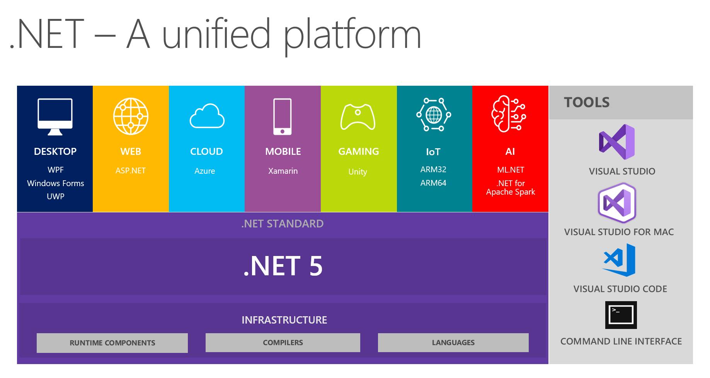
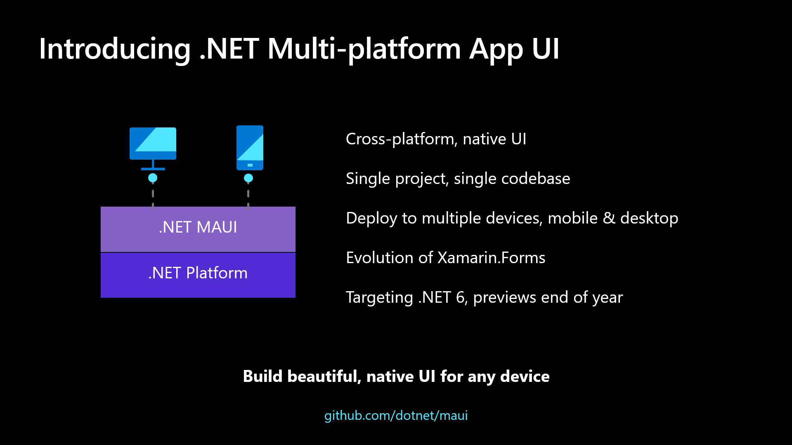

# .NET 5.0 and C# 9.0 for Xamarin Developers

.NET 5 has finally arrived and is one of the biggest releases on the history of .NET platform! being the first phase on the unified view that Microsoft unveiled last year, where we can finally have a single platform for our entire application stack.



But what does this means for Xamarin developers?

Last may Microsoft announced [.NET Multi-platform App UI](https://devblogs.microsoft.com/dotnet/introducing-net-multi-platform-app-ui/) (or MAUI for short); the future of Xamarin and Xamarin.Forms that makes Xamarin a first-class member of .NET. But, as this is such a big a change that it would not be able to be ready in time for .NET 5.0, so its postponed to version 6.0, expected to be released next year.

While we wait for MAUI and .NET 6.0, we have [Xamarin.Forms 5.0](https://devblogs.microsoft.com/xamarin/xamarin-forms-5-preview/) to look forward to in the immediate future. Including brushes/shapes support, swipe view, drag+drop, templating and much more!



The .NET team is also focusing its unification effort by bringing most of the .NET Core BCL implementation to Mono. This is exciting as we can take advantage of the [optimizations in  .NET 5](https://devblogs.microsoft.com/dotnet/performance-improvements-in-net-5/) in the most recent versions of Xamarin.Android and Xamarin.iOS. This source code unification should be ready by .NET 6, when they will be named **.NET for iOS** and **.NET for Android** (and the Xamarin brand will be dropped 😬).

Well, for now I've talked about the invisible part, but there's an important last piece that we can start using right now: **C# 9.0**! 🎉

## C# 9.0

The latest installment of the language is not automatically enabled for Xamarin projects, but [James Montemagno](https://montemagno.com/author/james-montemagno/) has done a [great post explaining how to enable it](https://montemagno.com/enabling-c-9-in-xamarin-net-standard-projects/?utm_campaign=Weekly%2BXamarin&utm_medium=email&utm_source=Weekly_Xamarin_286) while explaining the rationals behind language selection and availability.

But what's good about C# 9.0? Well, there are lots of new features, some postponed from previous versions and finally made available. One of these new features is **Record Types**. This is a language construct that allows us to declare data objects that can easily be made immutable, like:

```csharp
public record FeedEntry
{
    public string Title { get; init; }
    public EntryAuthor Author { get; init; }
    public DateTimeOffset Published { get; init; }
    public string Summary { get; init; }
    public string Content { get; init; }
}
```

The example above declares a `FeedEntry` class that represent a blog post on a site feed. Notice the use of the `init` in place of `set`. This ensures that the property can only be set once on object creation. Records declaration also have a simplified syntax:

```csharp
public record EntryAuthor(string Name, string Email);
```

This will declare an `EntryAuthor` record with the properties `Name` and `Email`. Then when creating new instances we can using the **Target-typed new expressions**:

```csharp
EntryAuthor author = new("Rafael Veronezi", "rafael@mfractor.com");
FeedEntry entry = new()
{
    Title = ".NET 5.0 and C# 9.0 for Xamarin Developers",
    Author = author,
    Published = DateTimeOffset.Now,
    Content = "<This blog post content 😎>"
};
```

Some developers prefers to have type annotation before the variable itself but like the conciseness of the `var` declarations. This new syntax allows for both and can also be used to initialize class fields and properties:

```csharp
public class FeedSource
{
    EntryAuthor defaultAuthor = new("Matthrew Robins", "matthew@mfractor.com");
    EntryAuthor GuestAuthor { get; set; } = new("Rafael Veronezi", "rafael@mfractor.com");
}
```

Last, but not least, suppose we need to set the published date on the instance we have created? Immutability is a concept from Functional Programming where we never mutate values on a object, but create copies with new values and we're covered here:

```csharp
FeedEntry entryWithSummary = entry with { Summary = "Get to know .NET 5.0 and C# 9.0 from Xamarin Developers PoV" };
```

Our initial record hadn't declared the `Summary` property. By using the `with` expression on the previous record we could create a new instance with all the existing values and adding the summary.

Well, that's a crash course on some of the features that I found most interesting and that I'll probably be using day-by-day, but there's lot more like [pattern-matching enhancements](https://docs.microsoft.com/en-us/dotnet/csharp/whats-new/csharp-9#pattern-matching-enhancements) and [Top Level Statements](https://docs.microsoft.com/en-us/dotnet/csharp/whats-new/csharp-9#top-level-statements) that you can check on the docs.

For now I hope I could give you some insight about what we already have available to us mobile developers. There are still some time until we get to MAUI and all the niceties to come with .NET 6, and we will keep exploring it on the months to come to make sure we provide the best tooling for developers to the nice new features and patterns we have head.

Stay tuned! 🙂
