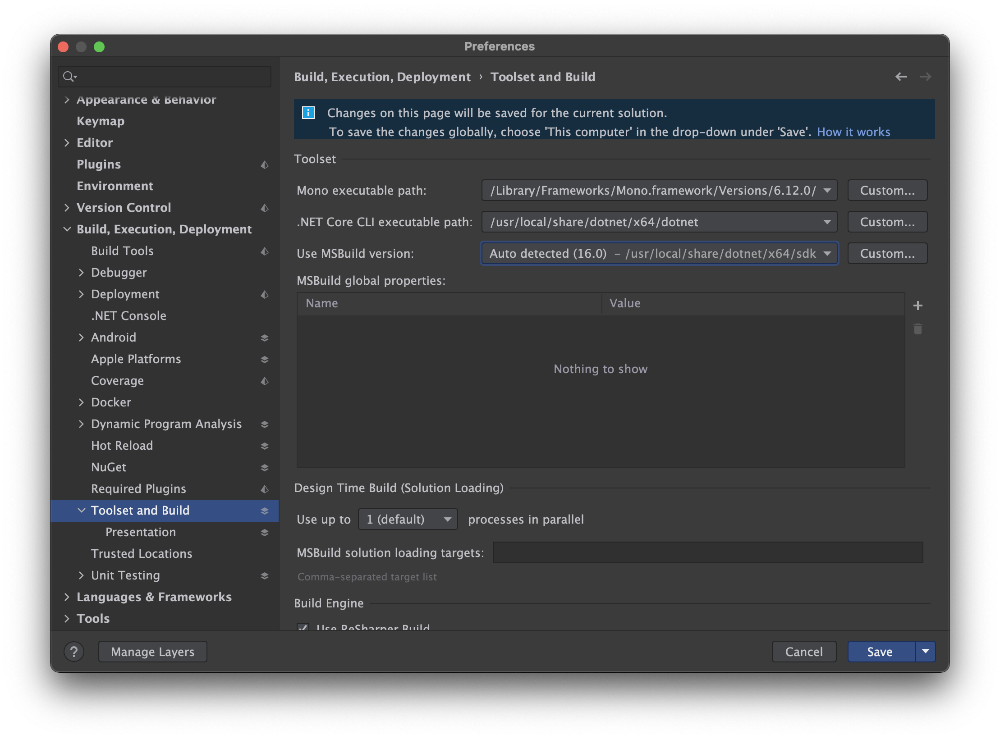

# .NET 6 for Mac with Apple Silicon Developers

Microsoft released .NET 6 with a great focus on the availability of its runtime and SDK compiled natively for the `arm64` architectures of Apple Silicon Macs. This is exciting news but, its just half of the history. When it comes to the developer side the native promise is still lacking decent tooling support.

This post is an attempt to document how I've setup my environment on a MacBook Pro with an M1 processor, trying to circumvent all the pains of being such an early adopter. 🤕

## The Problem

>Visual Studio 2019 for Mac doesn't support .NET 6 on Apple Silicon Macs **at all**.

This doesn't affect existing workflows like working in previous versions of .NET (5 and Core 3.1), and you can still setup your environment to work with your existing projects, like explained [here](https://devblogs.microsoft.com/visualstudio/developing-on-a-m1-mac-with-visual-studio-for-mac/) and [here](https://montemagno.com/setting-up-an-m1-mac-for-xamarin-development/).

The `arm64` of the .NET 6 SDK can still be installed and used to compile new projects. The limitation here is around the **tooling support**. When you install the latest SDK you should get this banner message on your IDE:

Clicking on the button leads you to a [support page](https://docs.microsoft.com/en-ca/visualstudio/mac/uninstall-net-2019?view=vsmac-2019) with a cryptic message:

>On Apple Silicon machines (also known as M1 or ARM), Visual Studio for Mac 8.10 does not currently support the .NET 6, .NET 5 and .NET Core 3.1 x64 SDKs released in November. It also does not support the .NET 6 Arm64 SDK. If any of these are installed, then they will break Visual Studio for Mac 8.10, and should be uninstalled, and the older .NET SDKs installed.

This is misleading and very confusing. Worst yet, the proposed solution is to uninstall all the SDK's and just install the latest ones without .NET 6. As I made it clear at first, .NET 6 is not supported on Visual Studio 2019 at all, **even if you install the x86 version of it!** But that shouldn't inhibit us from using the SDK from the command line with Visual Studio Code or other supported IDE.

The thing is, there is a workaround this issue. You can still have Visual Studio working correctly with previous versions by setting up the SDK Locations like below:

That should put you on a supported scenario where you can still work with your existing projects that you hasn't updated to .NET 6. The limitation is that you won't be able to work on those newer projects (and you will still get the annoying banner every time you open up Visual Studio).

## Visual Studio 2022 for Mac Preview

While Visual Studio 2022 for Windows was released along-side with .NET 6 last November, its macOS counterpart is still in a very early Preview. Microsoft has decided to do a huge refactor to the IDE migrating several parts to native macOS code which will allow full `arm64` support, but it will still take a bit longer until a stable release. Since the Preview 3 it added support to .NET 6, but you had to pick if you wanted it to work with the newer or the former versions, as described in the release notes:

>On Apple Silicon (M1 or Arm64) machines, the .NET 5.0, 6.0 and .NET Core 3.1 x64 SDKs, released in November, are not supported by Visual Studio for Mac 17.0 Preview 3. This is because the new x64 .NET SDKs install into a different directory and Visual Studio for Mac currently only supports the original .NET SDK install location, which is now only used by the Arm64 SDK.
> * If .NET 5.0, 6.0 or .NET Core 3.1 x64 SDKs are installed, then these should be removed, and the .NET 6 Arm64 SDK installed instead.
> * Learn how to migrate to .NET 6 Arm64 SDK with these instructions.
> * Visual Studio for Mac 8.10.13 and earlier versions are not supported side by side with Visual Studio for Mac 17.0 Preview 3.

This is a bit confusing, but I've decided to try things out and I've found that as of the Preview 4 I was able to either run it side-by-side with 2019 version and to fully compile and run a solution that mixed projects for different SDK versions (Core 3.1, 5 and 6), although there wasn't any words about it on the Release Notes.

This sounds like a workaround and Microsoft seems to be heading to add the desired support for the former versions of the SDK, but we can't lose from sight that Visual Studio 2022 for Mac is an early Preview and does not yet have several features and workloads already available in the 2019 version. As its still in preview, we don't recommend it as your primary development tool but we expect that to change once it is fully released.

It's never been easy to be an early adopter! 🤷‍♂️

## Using JetBrains Rider

JetBrains has been gaining momentum as a preferred IDE for .NET developers beyond the confusion that Visual Studio for Mac is in its current state. Its most recent version is fully support on Apple Silicon Macs and is already using .NET 6 as its backend.

It is possible to use Rider for either former and the latest .NET releases. The tricky is to select the proper version of the CLI tool on the Preferences:

This can be set per solution, which means that you won't be able to mix current and former versions on the same solution, but with a bit of organization on your project structure it works pretty fine! So depending on your workload (and your will to spend on buying a Rider subscription), it may come as a good alternative if you're on such scenario.

## What about MFractor?

MFractor runs on top the Visual Studio engine and is supported on Visual Studio 2019 for Mac. The current preview of Visual Studio 2022 is lacking extension support, so we are unable to provide an updated version that can support you on .NET 6 projects. We'll be working on an update as soon as Microsoft adds extensions back to the product. In regards to Rider, there are no plans for supporting it at this time, so if you stick with Visual Studio 2019 for Mac for now you should be good to go.

## Summary

The release of .NET 6 represents an important milestone for developers who prefer macOS as the first to support a native runtime and SDK for the Apple Silicon processors. Yet, there are issues and flaws related to the tooling that should be addressed overtime. We're just in the middle of the expected 2 year transition to the new architecture and a lot has evolved. The thing is, there's no turn back when it comes to processor architecture on Apple systems, but early adopters always pay the price.

I hope that this post may shed some light on developers who have gone all-in like me to the new system, and needs to setup its environment properly. Please share your comments if you find anything that I've might have missed.

May we all have a great 2022! 🎄🎊🍾🎉🎁