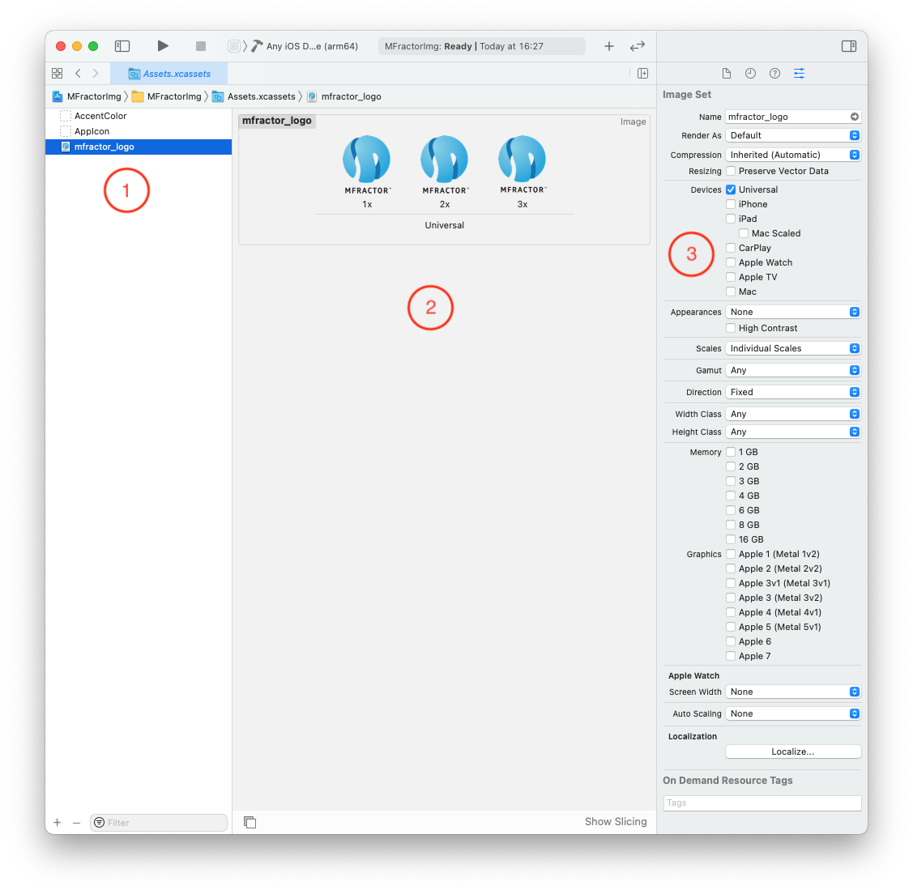
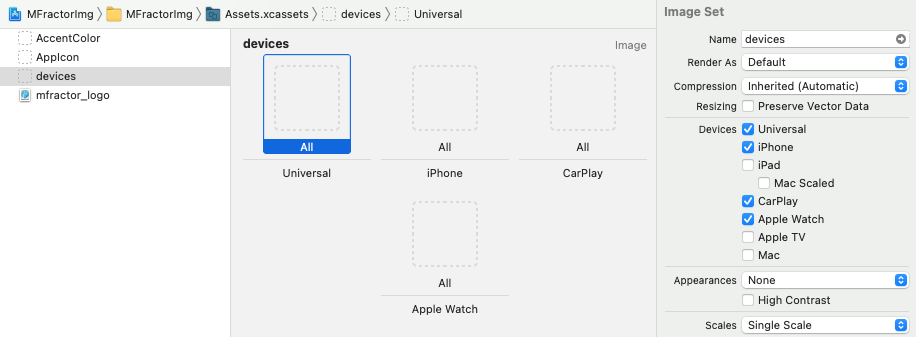

## Introduction

When developing apps you'll come to the point where you'll need to deal with image assets. No matter how crudiest the UI could be, you'll probably need some icons or small image resources to compose your layouts. In this post we'll explore how image assets works on iOS.

## The Problem

You might ask, why do I need to care about image assets? Aren't they just plain images that I render on my layout? It used to be that simple, but not anymore. But what are the problem with they so? Well, a little history will make things clear.

When Apple launched iPhone in 2007 they set the landscape for the "glass" shaped smartphones where we are today. A screen of 3,5` with 320x480 resolution was a big deal. Smartphone displays of that era was crappy ugly and pixelated. The iPhone display by contrast was very sharp and beautiful. For developers the fixed resolution made it very easy to design for iPhone in that very early years, and everyone was happy. 😌

But enough is never enough, so circa 2010 we've got iPhone 4 and its **retina display**, that doubled the resolution keeping the same screen size. The idea was that with such high res you couldn't notice the spacing between pixels and rounded edges would be naturally smooth.


That bump on the screen quality was very impressive and had a very good customer reception. But it comes with its own issues to developers. To take advantage of such high resolution our apps needed to adapt the layout of the apps and provide images that doubled its own density or they would look so small on the screen that would be impossible to interact with. Software upscaling was possible, but wouldn't produce that sharp edges that users were looking for.

And Apple, being Apple, started sometime to force apps to be compatible with the retina display, otherwise they would be rejected on the review. There was no escape for developers!

This is when image asset management hell was the born on iOS projects! For now own we needed to provide variations of the same image to match with the screen resolutions. Then came iPhone 6 Plus, that trippled the resolution, iPads, Retina Display Macs and, well, you got the idea...

Of course that tools were created to help with this new problem. They're what this post is about! 😎

## Understanding Screen Densities

Given our problem space, let's learn about screen densities! But first there is a few concepts to recall:

* **Screen Size**: referes to the physical size of of a screen that's normalized measured by its diagonal inches. The screen size by itself normally don't specify its aspect ratio (the ratio between its width and height that defines its actual size).
* **Resolution**: refers to how many **pixels** we have on a given screen. They are defined by how many pixels we have on the horizontal axis (the width) by the quantity of pixels on the vertical axis (the height), which forms a matrix. The amount of pixels on a given screen is the product of this two numbers. A few examples:
    * The original iPhone had a 240x320 screen resolution, with a total of 76800 pixels
    * iPhone 4 had a 480x640 screen solution with a whoping 307200 pixels!
* **Density**: the density of a screen is the relation between the phyisical size and resolution. Its normally measured by `ppi`, or **pixels per inch**, that is the quantity of dots or pixels that fits into an inch of that screen. The higher the density the better the quality of the image because with more pixels the image can more detailed.

So in the example above either the original iPhone and the iPhone 4 had an 3,5' inch display. While the original has a 165 ppi, iPhone 4 had an stunning 326 ppi! 

But what does this means in practice? A picture still worth a thousand words (no pun intended)...


The image above was taken from the article ["Real retina vs. non-retina photos"](https://artauthority.net/real-retina-vs-non-retina-photos/) and is the magnified photo of two Mac displays. On the left we have an image presented on a non-retina display. We can see that there's a lot of spacing around each of the dots that compromises the image quality.

On the right we have the same picture presented on a retina display. This is a screen that has the same physical size of the left one but the resolution is doubled. We can see that the spacing aruond each pixel is much smaller, producing a higher quality image with much more details. The rounded edges are a lot smoother, as an example.

The picture above is a close-up. We normally don't use a screen to close to our eyes to see it in that detail. So in effect when using a retina display you shouldn't be able to notice the spacing around pixels. The trick is revelead! 🪄

>If you're curious about all the iPhones screen size, resolution and PPI [there's an excelent reference on this site](https://iosref.com/res).

### What About Developers?

Historically developers of graphical interfaces always thought of developing UI's based on the screen resolution alone, and this was also true for the first generation of iPhones. We had a single device and it had a single display size and resolution where we draw our elements based on that available space, by doing simple calculations and rendering on absolute coordinates. With the introduction of retina displays we had a new higher resolution to cover which would immediatly break compatibility of our app with the new device.

The important thing to note is that increasing the screen resolution is all about **image quality**, as we show above, and not giving more drawing space. The iPhone 4 display had the same physical size but doubled the resolution so where we had 1 pixel now we had 4 pixels in the same space allowing us to represent much more detail.

But wait, what?! You told me that it's the double of the resolution, how do we have 4 pixels to 1 ratio? I'll try to picture that for you:


Let's pretend that the image above represent two slices of the same physical size, one cut from an original iPhone and the other from an iPhone 4. Each square represents a pixel, and its easy to see that where there was a single pixel on the first now fits four of them. Since we doubled the resolution on each axis we actually have 4 times many pixels than the previous generation. Another way of seeing it is that we can fit 4 screens of the original iPhone on just one screen of the retina display.

When running our app on a retina display we want to keep the UI elements with the same **physical** size and its just a matter of doubling the size of the elements themselves. But we don't want to manage different sizes for different devices. This seems the kind of problem that can be solved by software, and this is exactly what the `point` measure does.

Starting on iOS 4, Apple updated the whole `UIKit` library to start using the `Point` measure instead of pixels. This abstracts away our concerns about the **density** of the screen. From the developer point of view, he was still working with a canvas of 240x320 **points**. It is now up to UIKit to decide the **actual** size of an element depending on the device that the rendering is done. 

Ok, so this is quite a lot to grasp! 😓 And I myself took a long time to make a sense of all of this. But now we can advance to talk about images at least...

## Types of Image Files

Have you ever asked yourself how computers represent images? Alghouth this may be some basic knowledge to most developers, it's a good theme to revisit. When it comes to modern computer graphics there are two main ways of representing the images: **bitmaps** and **vectors**.

### Bitmaps

Bitmaps are just a matrix of rows and columns where each intersection is painted with a color. Bitmaps are best for representing pictures and highly detailed images, just like this one:


Well, its not a masterpiece but I hope it made you smile! 😆 I found it to be very representative of what a bitmap is. Of course its just a black and white image. But turning the bits into bytes let us represent a wide palete of colors for each pixel. Here's an example:


Here each pixel represet a number and by applying a pallete, which maps each number to specific color, we now produce a colored bitmap. The higher the number the most colorful the image can be.

Here we can also see that bitmaps has a fixed width and height, which represents its big downsize. Nowadays we have very good algorithms for shrinking or enlarging bitmaps, but there's always some loss.

### Vectors

Now we come to the vectors, which are more cool to programmers! They're are a mathematical representation of the shapes and glyphs that forms an image. This means that they can be easily scaled which make them very desirable for the responsive designs that we strive to produce in web and mobile apps.

To better understand vector images lets dirty our hands (just a little) of code. [PaintCode](https://www.paintcodeapp.com) is a drawing app like Sketch or Illustrator where you can make your designs. What makes it different is that instead of saving it to a file, PaintCode generates the code necessary to draw your image on screen with [`UIKit`](https://developer.apple.com/documentation/uikit).

>There are similar tools available for other platforms and UI engines.

Take a look at this screenshot from the app tutorial:


Notice that we have a canvas and below it a code section. 

The code itself is not important, but I want you to get a sense that it represents a series of instructions on **how** the image should be draw. In this example the image has a fixed size, but notice how we can easily introduce variables to resize it as you need, which will preserve its sharp quality.

This is the power of vectors!

There's a lot of debate around which type is better, and, as always when it comes to software engineering, the answer is: it depends! Each representation has its pros and cons and you should evaluate your usage scenario and requirements to take a better pick.

Generally speaking bitmaps are usually better for photography or highly detailed images where vectors deals better with shapes and abstract drawings.

Always check with your designer, they usually now what's best! 🧑‍🎨
 
### Representation vs. Storage

The discussion about bitmaps vs. vectors is all about how to digitally represent an image, but when it comes to storing that images it's a completely different story. Either bitmaps and vectors can be stored in several different file formats. This is because the way we represent this image as a data structure is not necessarly the best way to store it.

For instance, to save a plain bitmap to a file we need to store the color of each pixel in a matrix which is very wasteful. The most common formats for saving bitmap images are PNG and JPEG which employs compression algorithms to greatly reduce its storage size.

When it comes to vector images, the most common format is SVG (Scalable Vector Graphics), an open standard that emerged with web and spread through most platforms, which is just a plain XML file. Here's the content of a simple SVG for an information icon:

```xml
<svg xmlns="http://www.w3.org/2000/svg" 
    viewBox="0 0 24 24" 
    fill="black" 
    width="18px" 
    height="18px">
    <path 
        d="M0 0h24v24H0z" 
        fill="none"/>
    <path 
        d="M12 2C6.48 2 2 6.48 2 12s4.48 10 10 10 10-4.48 10-10S17.52 2 12 2zm1 15h-2v-6h2v6zm0-8h-2V7h2v2z"/>
</svg>
```

Notice that you can easily modify this file to change it's "viewbox" (the size of the canvas), the width and height or the fill color. More adventurous people may want to mess with the path coordinates, but I think its better to have some image editor for that. Below we can see the actual image:


Notice that although its 18x18 pixels in size we have a applied a 500% zoom and there were no loss in the image quality.

>**Tip**: Gaplin is very useful free tool for macOS to with SVG files. It has a decent previewer and an exporter to save as PNG or other common image formats.

There are several other file formats such as EPS (Extensible PostScript), AI (from Adobe Illustrator) or PDF. Although vectorial images are usually associated with shapes, each of those formats allows you to describe more complex types of elements such as texts and even embbed bitmaps inside a document.

Vectorial images have a very rich and interesting history that dates back to the PostScript language, the most popular effort to create a standard for describing documents for printing. This has evolved until our modern standards that allows us to store rich image assets in a very optimized way.

>Understanding those differences about image types and their storage is key for organizing the image assets of your project. Also this will allow you to communicate better with the design team. 

## Understanding iOS Image Assets

The iOS SDK supports, out of the box, several types of image formats and has built-in API's to handle loading and rendering of those assets. On this post we will keep our focus on the UIKit framework. There are other low-level API's to directly manipulating image files or working with different formats and other kind of tools for frameworks like SpriteKit for high-performance graphics.

On the previous section we've presented why image management became a basic subject of app development with the introduction of Retina Displays. With this we had to deliver different versions of the same image. But the density is not the only the only thing we must take into account for modern apps. Let's break down some of variations that an image asset can have:

* Variations for specific devices (Apple Watch, iPad, Apple TV, carOS, etc)
* Direction (LTR or RTL depending on the language)
* Width and Height classes (for use with [Size Classes](https://developer.apple.com/library/archive/featuredarticles/ViewControllerPGforiPhoneOS/TheAdaptiveModel.html))
* Light and Dark themes
* Localized imagess

There's also other variations that are so specific that it's not worth mentioning, and to be fair, I personally never got beyond density, theme and localized images. The important thing about variants is that the iOS SDK has some clever API's that automatically select a variation for a specific context.

With this basic understanding of variations let's explore how they can be organized and used inside our iOS projects.

### Bundle Resource Images

This is basicaly plain image files. Adding this kind of image is much like adding any regular file to your project. For Xcode projects just drop your image into a group and ensure that its added to your target:


We call it "Bundle Resources" because they are copied to the application bundle. Take a look of the contents of the application package produced by Xcode and noticed how the files is copied to the root of the package:


Although Bundle Resources being just regular files copied to your application package, Apple added a few tricks to it to deal with the density issue we've seen above. Have you noticed the other two files with the odd suffixes? Let's understand what it is about.

#### File name suffixes

Remember that to deal with multiple resolutions we have to provide different versions of the same file. Those versions are called **variations**. This as a mechanism that allows iOS to automatically select the best image for a given density based on some conventions. 

The suffixes on the file name are used to identify the density of the image so in the example above we've provided 3 variations of the MFractor logo image and appended the `@2x` and `@3x` suffixes to identify the screen density to which it corresponds.

Let's put them to use, here a sample design:


Its far from being a design masterpiece but enough for our purpose. The Logo image is a 250x297 **points** in size. As we've told before, points is a base measure that is automatically scaled upon the actual screen density. Let's summary the variations we've provided:

* `mfractor_logo.png` - **250x297**:  this is the basic image size and suits iPhones prior to 4 and iPads prior to 2.
* `mfractor_logo@2x.png` - **500x594**: this suits the first generation of retina displays that came with iPhone 4 and above and most of the iPads
* `mfractor_logo@3x.png` - **750x891** (`@3x`): this fits most of the modern iPhones and was introduced with iPhone 6 Plus that had a very high density screen

>**Important**: Notice that the scale factor 1 refers to devices that are retired for almost a decade by now so in practice we don't use it anymore.

Using densities suffixes makes it a lot easier to organize and handle our files. Having the images named like that on your project is sufficient for UIKit to make the call on which image to load and render on the screen, as long as we don't add the suffix when referencing the image file name. It keeps track of the density of the device where your code is running and automatically select the preferred image.

### Asset Catalogs

The Asset Catalogs was introduced some time later to aid on organizing and browsing through those image assets. Catalogs are pretty much folders where files are organized in a specific way with some additional metadata and Xcode provides a special UI for managing the assets of that catalog that looks like the following:



There's a lot to learn from the screenshot above, let's check it out:

1. This navigation area lists all the assets on this catalog.
2. When an asset is selected we can edit its variations on the main editor.
3. The Attribute Inspector allows us to edit all the characteristics of this particular asset.

In this example the selected asset is our logo image, identified as an **Image Set**. This distinction is important because catalogs supports several other types of assets as we can check on the Add menu:


Here we can see that catalogs is not just about images, but other kinds of assets like Colors and even Data Sets that are pretty much any kind of data file that you may wish to have organized on a catalog. But all those other types of items in the catalog is subject of another post, lets focus on the Image Sets.

Its important to note that an Image Set represents a **single image**, and in code we only reference it by the name of the set itself. Generally you don't ask for a specific image of the set, this is decided automatically based on the attributes and on the images available, so if you've setup your catalogs correctly you can expect it to work it _automagically_!

#### Dark and Light Themes

In the previous sections we've examined the density aspect of an image, but over time another kinds of variations has emerged and the Asset Catalog proven to be very useful to support those new capacities. Probably the most useful of them is the Dark and Light themes support. If you check on the Attributes Inspector (item 3 above) you can see a option for _Appearance_. The following options are available:


Since iOS 13 users can choose between light and dark themes as an environment setting. Our apps are expected to respond to those changes and adapt the interface to include a dark appearance. Supporting dark themes greatly enhances your user experience because it allows users to adapt their usage to their lighting conditions. Dark themes are very confortable to use on low light environments.

For the developers this means that they must include versions a dark variant of most images to adapt or correctly contrast with the darker colors. Asset Catalogs makes this very convenient by allowing you to specify dark versions of the same image. On the _Appearance_ attribute select the `Any, Dark` option and a new row of boxes will appear for us to fill:


Notice the added row of Dark Appearance images. They're equivalent to the top ones but they will be selected by UIKit once the user changes to Dark Theme system wide. Better than that, **all the images will be automatically reloaded to match the new theme**. This is the power that Asset Catalogs brings to us. But wait, there's more!

#### App Thining

Having multiple versions of the same image on a project introduced a new problem. The size of your app incresed substancially because it needed to support those multiple devices, but having a image that is never going to be used is a waste of storage and network traffic.

App Thining was introduced as a set of features designed to reduce your app size. It creates several variants of your App Package optimized for specific devices and delievers those 

When it comes to image assets _App Slicing_ is the one that has more interest to us. There's also _On Demand Resources_, which allows you to create sets of images that can be downloaded on demand, but I will skip talking about it for this article. 🙂

>The third feature of App Thining is **Bitcode**, which allows your app to be recompiled by Apple on the server to generated optimized versions of it. This is a interesting feature but is out of the scope of the subject of this article. Take a look at the docs for more information.

App Slicing is a server-side feature provided by the App Store engine. When the user downloads your app it receives a cutoff version of the original package with the images that doesn't fit that device screen density are removed. For example:

* An iPhone SE or iPhone 11/XR should receive a package that contains only the `mfractor_logo@2x.png`, because their screen is a 2x density.
* All the iPhone 12 lineup has 3x density screens, so they should receive a variant of the package with only the `mfractor_logo@3x.png`.

The best thing is that this happens automatically!

### PDF Image Assets

Apple introduced PDF Image Assets with Xcode 6 as an option to use vector images. The idea is that you can replace all the density versions with a single file. To use this, on the Asset Catalog select the image set that you want to use a PDF file and on the Attribute Inspector change the `Scales` property to `Single Scale`:


Notice that changing this the tool will only accept a single image input for each device that you may select:



Although this greatly simplifies file management, using PDF assets may be misleading. When introduced it was more of a Xcode tool than an UIKit feature. It works at compile-time by transforming the PDF into PNG versions of each supported scale, which is not a bad thing, but has it issues.

The thing is that PDF may mix Vectorial and Bitmap parts which leads to odd results when resizing. There's also issues with exported masks and gradients. There's a very interesting article named [Why I don't use PDF's for iOS assets](https://bjango.com/articles/idontusepdfs/) that is a must read if you're considering using PDF's.

Later on Apple added the `Preserve Vector Data` option to the Image Set with Xcode 9. With this option checked the actual PDF is bundled into the application package and this scaling is done at runtime. This allows us to benefit on vector for upscaling an image for example (by override its intrinsic size), but suffers from the same issues presented above.

Despite of those drawbacks PDF assets are an useful tool on your toolchain, so doesn't just drop it. Keep in mind the stuff above and it should be helpful.

#### Vector (SVG) Image assets

Well, this is the fancy name for SVG support. We have already talked about it on our discussions of image representations. SVG's are largely used on the industry. Browsers supports it natively (you can even embbed it into HTML) and Android has been using it for so long, so I don't understand why it took so long to have a native support within Apple platforms.

To use SVG's on your Asset Catalog is pretty much the same setup for PDF by selecting `Single Scale` for the `Scales` option, but instead you drag an SVG to the Image Set:


Here we've added 2 new image sets for an email and password icons that we've got from the Material site (!!todo get links). We've just set it as Single Scale and dropped the SVG files on the catalog. This is pretty much what you need to do to use SVG's in your code.

SVG's are a very welcome addition to iOS but unfortunately its only available from iOS 13 and above (and only when using Xcode 12), which means that you may wish to stick with PDF's or plain images for some time if you need to support versions prior to that.

### SF Symbols

Apple introduced [**SF Symbols**](https://developer.apple.com/sf-symbols/) with iOS 13 as a set of built-in high quality icons on top of the San Francisco Font. Using SF Symbols to provide icons for your apps has several advantages:

* Symbols are high quality vector graphics that can scale to multiple sizes
* They are built into the operating system and doesn't add any overhead
* They don't need any extra setup, just reference the symbol by name and use it on your screen
* They are the same glyphs used throughout the operating system itself so using them provide a consistent experience to the user
* It's a very convenient for stand-alone developers that doesn't have much design resources

There are more than 2400 symbols to choose and they've also introduced some multicolor ones. You can download the ]SF Symbols App](https://developer.apple.com/sf-symbols/) to browse through the entire catalog and get the symbol names (that is what you use to load them on your code). It allows you to create custom collections for the icons that you use on your apps.


There's nothing much we can say against SF Symbols, except that its only available from iOS 13 and that new symbols are being added as each new major release is made. You may also want to avoid it if you need to create a consitent identity across platforms, since its not available to Android or other OS'ses.

## Using Image Assets in code

The iOS SDK makes it very easy and convenient for us developers to use our image assets in our code. Most of the time it is just a matter of referencing the asset from its name, so having good standards for naming your assets is a good help.

Loading images is mostly done through the [`UIImage`](https://developer.apple.com/documentation/uikit/uiimage/) class. It has several initializers that allows loading images in different ways from different sources, but the most common is the `init(named:)`, 

Here are some rules, if you're loading from:

* **Bundle Image Resources**: use the name of the file without extension and **without the density suffix** (`@2x`, `@3x`, etc.), that way the variant that best fits will be automatically selected for you.
* **Images Inside Asset Catalogs**: use the name of the image set that you want to load.
* Other sources, explore the `UIImage` docs to check all the possible ways of loading an image, like an in-memory binary representation (`NSData`) or even from other bundles.

Let's bring some examples on how you can do it using different SDK's.

### UIKit and Xamarin.iOS projects

The UIKit is the classical iOS interface development library. Images are loaded through the `UIImage` component and presented on the screen with the `UIImageView`. If you're using View Code here's a snippet for presenting an image in a Swift Playground:

```swift
let image = UIImage(named: "mfractor_logo")
let imageView = UIImageView(image: image)
```

Pretty simple two liner!


Xamarin.iOS is a just a wrapper around `UIKit`, the same code in C# would be:

```csharp
var image = new UIImage("mfractor_logo");
var imageView = new UIImageView(image);
```

If you're using XIB's or Storyboards you can add an `UIImageView` component to your layout and set `image` property on the Attribute Inspector:


Notice that the dropdown will show the images available on your project.

### SwiftUI

If your project is using SwiftUI all you need is the `Image()` passing the name of the asset as of the rules we've set above. Here's a snippet from our sample app:

```swift
HStack {
    Image("ic_email")
    TextField("E-mail", text: $email)
}.padding()
```

This declares an icon to illustrate the purpose of the text directly beside it. Here's the full screenshot of this implementation:


The `Image()` component has a few overloads of its initializer that allows you to load images from different sources, but any further customization is done through the _modifiers_. Take a look on the code of the image that declares the _devices_ image:

```swift
Image("devices")
    .resizable()
    .scaledToFit()
    .frame(width: 200)
```

The `devices` asset is a PDF image that is very large (more than 600 points), so in order to make it fit better our purpose we have made resizable, used `scaleToFit` to make it resize proportionally and set its frame to 200 points, making it fit better on the actual screen.

Last but not least, suppose you want to replace the icons images with SF Symbols. You just use a different initializer with the `systemName` argument, such as:

```swift
HStack {
    Image(systemName: "envelope")
    TextField("E-mail", text: $email)
}.padding()

HStack {
    Image(systemName: "lock")
    SecureField("Password", text: $password)
}.padding()
```

Which results in the following appearance:


### Xamarin.Forms

In Xamarin.Forms we present images with the `Image` component like so:

```xml
<Image Source="mfractor_logo" />
``` 

You can simply pass the name of the asset you want to load to the `Source` property as of the rules we've set above. This works because on the covers there's a `UIImageView`, so the Xamarin.Forms encapsulates the same calls on the UIKit section.

## Summary

Working with images in mobile projects should be a common and trivial task, but has its specificities that we should be aware of when it comes to screen densities. Also, other kinds of image variations has been introduced over time, like the Dark and Light Themes.

In this article we've introduced this problem from the point of view of the iOS developers, but Android developers falls in very similar issues (with similar solutions), and maybe we can talk about it on another post. Leave us a comment and let us know if you find this content useful and wants a similar approach for Android.

In closing, I'm leaving a few references for this subject so you can take a deeper look into the subject:

* [SVG Assets in Xcode for Single Scale Images](https://www.avanderlee.com/xcode/svg-image-assets/)
* [SF Symbols: The benefits and how to use them guide](https://www.avanderlee.com/swift/sf-symbols-guide/)
* [Drawing and Printing Guides for iOS - Loading Images](https://developer.apple.com/library/archive/documentation/2DDrawing/Conceptual/DrawingPrintingiOS/LoadingImages/LoadingImages.html)