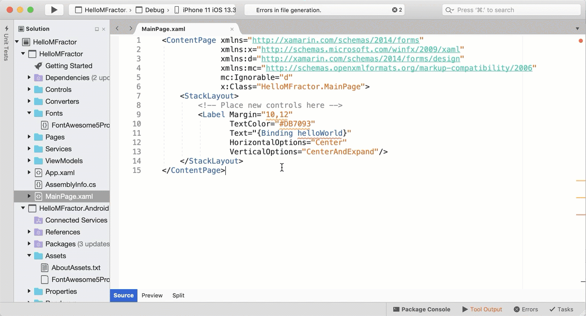
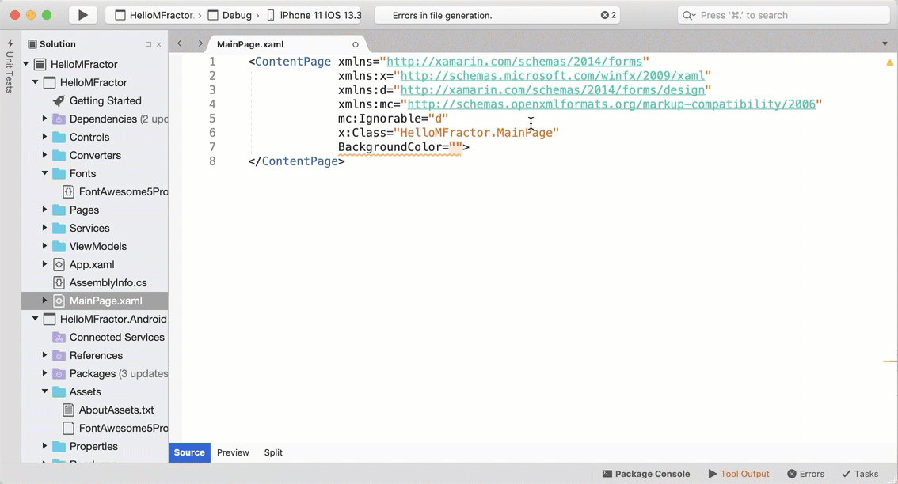

# MFractor 3.10

Kicking of the decade we have just released MFractor 3.10, a big upgrade

Let's dive into each feature.

# Inline Code Fixes

One of MFractors strengths is that it can spot 80+ common issues in XAML, from missing view model properties to matching styles.

We've always offered many fixes to resolve code issues, however, they weren't intuitive to use.

MFractor 3.10 includes a revamp code issue tooltip that includes any available fixes for the issues it spots.

To fix a code issue, simply click on one of the available fixes:

# Image Tooltips
Building mobile apps is asset-heavy and image resources are one of the backbones of development. However, one of the difficulties when working with images is locating the correct resource when coding.

To make this easier, we've introduced image tooltips to let you preview any image asset.

Simply hover your cursor over an image name and a preview of that image will display. We also preview that image in IntelliSense!

Even better, image tooltips are also support on Android resource lookups in C#:

## And Much More

Lastly, MFractor 3.10 includes a tonne of additional features, enhancements and bug fixes.

At a glance:

 * Color tooltips in XAML:
   * Hover over a color to preview it.
   * In IntelliSense, we display a preview of the color as a tooltip.
   * For StaticResource expressions that evaluate to a color, we provide a tooltip of the color the resource will return.

 * Static Resource refactorings:
   * Use the **Move to App.xaml** refactoring to shift a resource from a page or control into the App.xaml file.
   * Use the **Refactor into static resource** code action to shift an attributes value into a resource entry in the current file or in the App.xaml.
 * The new **Generate Font Character Code Class** creates a C# class with all font character names and icons available as string constants.
 * A revamped activation dialog plus shortcuts to request trial license and recover Professional licenses.
 * Integrated help links into many features.
 * And more!

The full release notes for MFractor 3.10 be found here.

To get full access to inline code fixes, image tooltips, color tooltips and all our other features, purchase a license at https://www.mfractor.com/buy.
