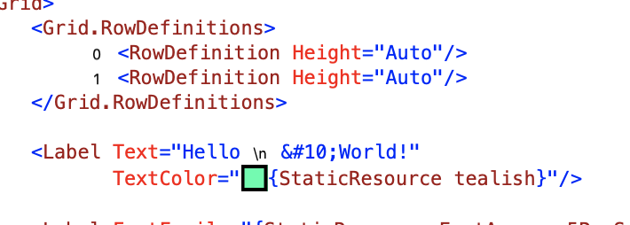
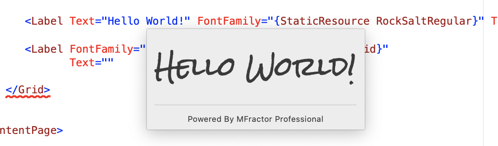
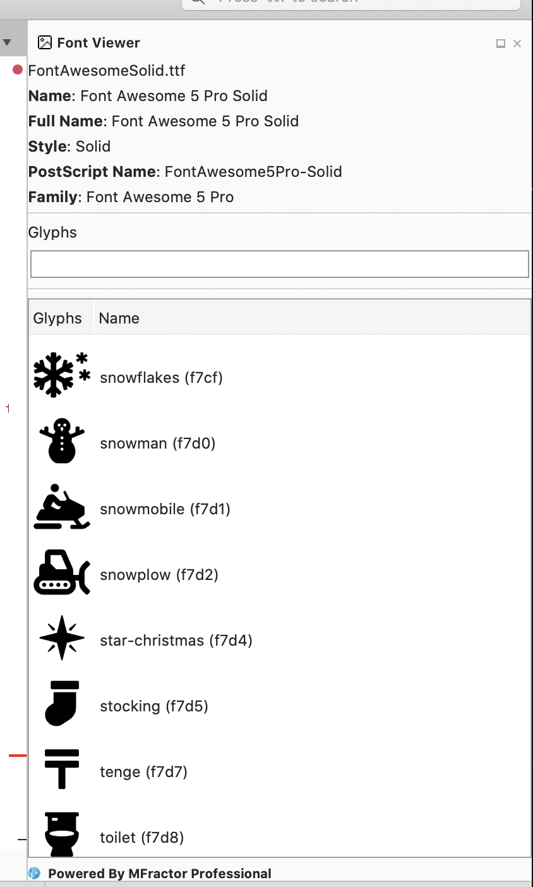

## Introduction

I'm excited to announce the release of MFractor 4.1 🥳

This release is a significant upgrade to MFractor that includes automatic trials, adornments to make it easier to understand your XAML at a glance, enhancements to font tooling support and much more.

Let's dive into this release.

## Automatic 30 Day Trials

When you install MFractor you will now be automatically issued a 30-day trial of MFractor Professional. Previously trials were issued on a by-request basis which, unfortunately, meant that many people evaluating MFractor did not get the best product experience.

These 30-day trials allow you to explore MFractors advanced features and really get a good idea of what the product has to offer. With automatic trials, you now have unlimited use of Image Manager, MVVM navigation tools, code generation wizards, font importer and more for 30 whole days!

MFractor Professional 30-day trials are restricted to one per machine OR email address. Once your trial expires, please purchase a license at [https://www.mfractor.com/buy](https://www.mfractor.com/buy).

## Adornments

MFractor now annotates your XAML file with 3 kinds of adornments to reveal extra, contextual information that assist when editing XAML.

 * Grid adornments display the index next to the
 * Color adornments show a small preview of an inline color value. This also works for static resource expressions that reference a color.
 * Escaped XAML character adorments show the literal character represented by an escaped XAML character sequence.

## Enhanced Font Tooling

Over the past few months, Microsoft has significantly improved the font experience with the addition of Embedded Font Assets; I've worked to keep pace and ensure that MFractor supports this methodology.

In addition to embedded font support, MFractor now includes IntelliSense, tooltips and analysis for font glyphs:

MFractor can now also display a preview for a font asset:

Lastly, MFractor for Visual Studio Mac now includes a font viewer pad that you can use to visually explore the contents of a font asset:

## Additional Features/Enhancements

In addition to the adornments, font tooling and 30-day trials, MFractor now also includes:

 * New insert/delete grid row and column refactorings.
 * Detection of C# style newlines used in XAML with a code warning and fix.
 * Image manager support for UWP projects.
 * Code analysers to detect duplicate color and thickness values across the solution with a code fix to consolidate them.
 * Fixes to the binding analysis engine to support x:DataType and usage of `x:Reference` against the root XAML element.

For a full overview of what is included in 4.1, please see the 4.0 iterative release notes:

 * [4.0 Release Notes (Mac).](https://docs.mfractor.com/release-notes/mac/v4/v4.0/)
 * [4.0 Release Notes (Windows).](https://docs.mfractor.com/release-notes/windows/v4/v4.0/)

## Summary

MFractor 4.1 is a significant upgrade to the product and makes the Xamarin.Forms development experience much smoother.

Since the release of MFractor for Windows two months ago, it's been incredible to receiving feedback from users and using it to improve the product. Thanks to all my customers and users, let's keep pushing the Xamarin tooling forward together!

😀🤙
Matthew Robbins
