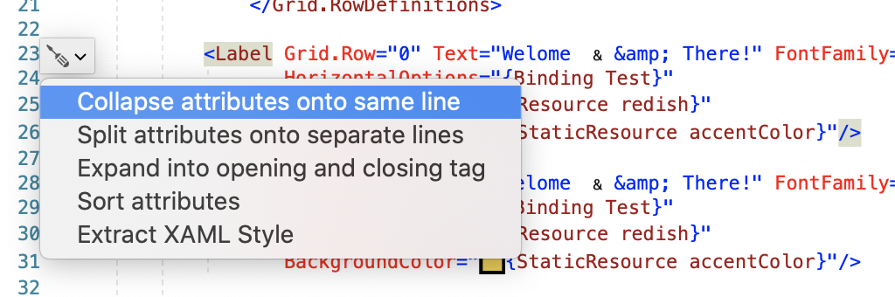

## Overview
It's been a huge week of announcements at Build with news of C# 9, MAUI, new Visual Studio releases and so much more. It's enough to make one drool! 🤤

## MAUI Roadmap

Last week at Build, [Microsoft announced MAUI, Multi-platform App UI](https://devblogs.microsoft.com/dotnet/introducing-net-multi-platform-app-ui/), an evolution of Xamarin.Forms. Over the past 5 years, we've watched Xamarin.Forms become a powerful app framework and it's gosh-darn incredible news that it will now become part of .NET itself through MAUI.

MFractor will support MAUI through each of its preview phases and we will be actively seek feedback and feature ideas to support the community throughout the transition.

The name **MFractor** was originally concieved by combining Mono + Refactor so it's great to see it can now be MAUI + Refactor. 😉

## MFractor 4.2 Release Overview
Here is a quick rundown of what's included in the 4.2 release.

### Support For Latest Visual Studios

I'm pleased to announce that the release of MFractor 4.2 to support Visual Studio Windows 16.6 and Visual Studio Mac 8.6. These releases target the latest stable version of each IDE and have been compiled and tested against them.

### Serial Key Based Licensing
MFractor Professional is now activated through a serial key! 🥳

For the past few years, MFractor Professional has been activated via a license file attached to an email. This system worked well however it some issues like firewalls blocking our license emails, the fact it was easy to lose the license file and that it wasn't intuitive to activate your installation.

With the new system, it's simply a matter if copying/pasting the serial key into MFractor to activate. Dead simple!

If you have already purchased MFractor, you are unaffected by the transition to serial keys as your MFractor installation

### Built-In License Recovery
If you've lost your license file and want to get it back, MFractor now includes a Recover License menu item. Enter the email address that you used to purchase MFractor and you'll receive your license via a recovery email.

### Integrated Code Actions in Visual Studio Mac

MFractor includes over 100 XAML code actions that, until now, have been tucked away inside the **MFractor Code Actions** menu in Visual Studio

The 4.2 release exposes our code actions through the Light Bulb and Screwdriver menus accessible in the side bar of the text editor. You can also access our code actions by pressing `Alt+Return` in a XAML document.

### Memory And Performance Improvements

Over the past two weeks I've been frequently talking with our customers and diagnosing performance issues in MFractor.

I've identified and fixed several potential memory leaks and performance issues to help make your IDE smoother.

If you find any issues or bugs in MFractor, please report them here: [https://github.com/mfractor/mfractor-feedback/issues](https://github.com/mfractor/mfractor-feedback/issues)

## Learn About Blazor In The Wild

My good friends at [Melbourne App Development](https://melbourneappdevelopment.com/) are successfully using Blazor in several large-scale production systems and are sharing their learnings in two special live-stream events. Covering both the technical and business aspects of their success, these livestreams will be super interesting to understand how Blazor could be applied back into our own jobs/businesses.

If you'd like to join and learn more about Blazor in the wild, RSVP to one of the following events:

 * [Blazor for Large Systems (session 1) - Wednesday, May 27, 2020 6:30PM to 8:00PM AEST.](https://www.meetup.com/Melbourne-Xamarin-Meetup/events/270686929/)
 * [Blazor for Large Systems (session 2) - Thursday, May 28, 2020 10:00AM to 11:30AM AEST.](https://www.meetup.com/Melbourne-Xamarin-Meetup/events/270687176/)

😚👌
Matthew Robbins
