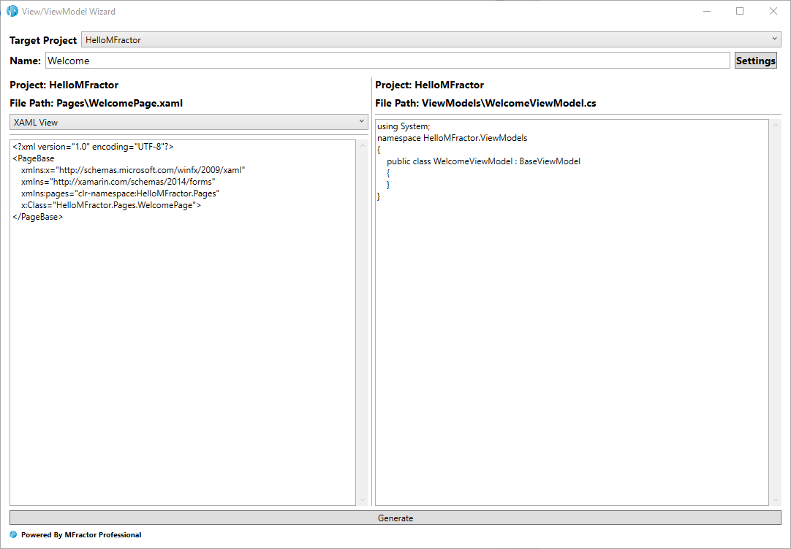

## Introduction
[MFractor](https://www.mfractor.com) is a popular Visual Studio extension among macOS Xamarin developers,
 beloved by its powerful features to enhance Mobile Development workflow. After years of intense development, its finally debuted on **Visual Studio for Windows**, bringin all of its powerful features to Windows developers.

On this post we'll take a look at [**MFractor for Windows**](https://marketplace.visualstudio.com/items?itemName=MFractorPtyLtd.MFRACTOR-VS-WINDOWS) and how it can boost your productivity as a Xamarin and .NET developer. 

[MFractor](https://www.mfractor.com) is a Visual Studio Mac extension popular among Xamarin developers for its powerful mobile development tools. After years of development, it is now available for Visual Studio Windows!

In this post we'll dive into [**MFractor for Windows**](https://marketplace.visualstudio.com/items?itemName=MFractorPtyLtd.MFRACTOR-VS-WINDOWS) to discover how it can boost your productivity as a Xamarin developer.

## Powerful Tools For Xamarin.Forms Developers

Using Xamarin.Forms, developers and businesses can build beautiful applications in .NET for Android, iOS and Windoes from a single codebase.  is loved by developers for its powerful cross-platform capabilities, Powerful platforms demands powerful tooling, so we can extract the most with less effort.

This is the mindset that drove the features of MFractor for Xamarin.Forms developers. This tooling enhances your development experience by adding hundreds of [Code Analysis](https://docs.mfractor.com/feature-matrix/#xaml-code-analysis) and [Code Actions](https://docs.mfractor.com/feature-matrix/#xaml-code-actions) for editing XAML files, [shortcuts to navigate around your code](), wizards for adding [Fonts](https://docs.mfractor.com/fonts/importing-fonts/) and [Value Converters](https://docs.mfractor.com/xamarin-forms/value-converters/value-converter-wizard/) and tooltips and adornments to enhance your edit and Intellisense experience.

### Made for MVVM

The Model-View-ViewModel pattern is the de-factor standard for Xamarin.Forms. With it, we can leverage data-binding in XAML to

MFractor make it really easy to work with it by adding handful features such as the MVVM Navigation, Wizard, Intellisense and several code actions.

MFractor understands industry-standard naming practices to automatically discover view models for Views. Check out the [Binding Context Resolution docs](https://docs.mfractor.com/xamarin-forms/binding-context-resolution/overview/) to understand our discovery rules. The conventions you've adopted in your project is almost certainly covered, and [your feedback is always welcome](https://github.com/mfractor/mfractor-feedback/issues/new) to enhance the product.

Let's run through some of the most use

Data-binding is a huge part of Forms development, and MFractor also keeps you covered. When writing a binding-expression, intellisense is enhanced to add all the properties available on the Binding Context:

Similar to Resources, [Bindings are checked against the context](https://docs.mfractor.com/xamarin-forms/working-with-viewmodels/data-binding-analysis/) to prevent errors that would only be catch at runtime, such as typos on the properties names:

It may be a simple typo and once again you can replace with the correct name, but notice you can also generate a new property with the name of the binding expression directly from the fixes on the tooltip. This is very effortless and time saving!

When working with a View you can quickly switch between the XAML file, its code-behind and its View Model using keyboard shortcuts that can be easily be remembered:

When working with MVVM every time you want to create a new View you need to setup different files. Most projects uses base classes for the `View` and `ViewModel` objects. This kind of repetitive, tedious and error prone is where MFractor shines at. By using  the MVVM Wizard you can create a new View with its ViewModel while preview the output:

The wizard allows for a high level of customization. You can define the suffixes for the classes, where they will be placed and which base class they will derive. This is specially useful for XAML files, since the tool will free you from the pain of having to add xml namespaces, changing the root tag and the base class name on the code behind. Once your settings are made up your only concern will be to choose a name for you view! 😎

### Craft Beautiful XAML

XAML is a powerful language for describing your UI. Yet, most its features are built on top XML and are "loosely" joint. This is the case of Resource Dictionaries, a feature that allow us to declare shared resources that are referenced by a string key. Sometimes though we may have typos that will only be found when the app crashes at runtime 🤯...

MFractor to the rescue! The [static resource analysis](https://docs.mfractor.com/xamarin-forms/static-resources/analysis/) will check every reference declaration to make sure it resolves to an item on the resource dictionary of that declaration scope. An error will be shown when MFractor identifies that a reference

Notice that a very descriptive message is shown on the tooltip, but also, you have a few available fixes. MFractor is smart enought to figure if you may have done a typo, and suggest resources with similar names.

But notice also that the resource in question is a style, an important part of UI composition that gets special attention on MFractor. One of the available fixes allows you to easily create a new style from the element, enters the Extract Style feature, a Wizard that allows you to quickly extract properties of current element into a style to be placed on the current file or in the project-wide `App.xaml` dictionary.

The [Extract XAML Style](https://docs.mfractor.com/xamarin-forms/working-with-styles/extracting-styles/) is a powerful tool to create styles from properties of existing elements. In the example above you can create a new style based on the properties of that Label. You can even change those properties or add new ones, and the right-pane preview allows you to check exactly what changes MFractor will make to your code.

Working with Grids is sometimes confusing when setting rows, columns and spans, which may render unexpect results on the layout. The [Grid Analysis](https://docs.mfractor.com/xamarin-forms/grids/analysis/) adds several checks for `Grid.Row`, `Grid.Column`, `Grid.RowSpan` and `Grid.ColumnSpan`. In the following sample the analyzer alerts for an element that is being declared to a third column that is no part of the definitions:

Similar checks are made to row and column spans, so you can easily know if a span goes of the bounds. Those kind of checks are simple but saves a lot of time designing layouts.

XAML is a powerful language for describing your UI. Yet, most its features are built on top XML and are "loosely" joint. This is the case of Resource Dictionaries, a feature that allow us to declare shared resources that are referenced by a string key. Sometimes though we may have typos that will only be found when the app crashes at runtime 🤯...

MFractor to the rescue! The [static resource analysis](https://docs.mfractor.com/xamarin-forms/static-resources/analysis/) will check every reference declaration to make sure it resolves to an item on the resource dictionary of that declaration scope. An error will be shown when MFractor identifies that a reference 

Notice that a very descriptive message is shown on the tooltip, but also, you have a few available fixes. MFractor is smart enought to figure if you may have done a typo, and suggest resources with similar names.

But notice also that the resource in question is a style, an important part of UI composition that gets special attention on MFractor. One of the available fixes allows you to easily create a new style from the element, enters the Extract Style feature, a Wizard that allows you to quickly extract properties of current element into a style to be placed on the current file or in the project-wide `App.xaml` dictionary.

The [Extract XAML Style](https://docs.mfractor.com/xamarin-forms/working-with-styles/extracting-styles/) is a powerful tool to create styles from properties of existing elements. In the example above you can create a new style based on the properties of that Label. You can even change those properties or add new ones, and the right-pane preview allows you to check exactly what changes MFractor will make to your code.

Data-binding is a huge part of Forms development, and MFractor also keeps you covered. When writing a binding-expression, intellisense is enhanced to add all the properties available on the Binding Context:

Similar to Resources, [Bindings are checked against the context](https://docs.mfractor.com/xamarin-forms/working-with-viewmodels/data-binding-analysis/) to prevent errors that would only be catch at runtime, such as typos on the properties names:

It may be a simple typo and once again you can replace with the correct name, but notice you can also generate a new property with the name of the binding expression directly from the fixes on the tooltip. This is very effortless and time saving!

Working with Grids is sometimes confusing when setting rows, columns and spans, which may render unexpect results on the layout. The [Grid Analysis](https://docs.mfractor.com/xamarin-forms/grids/analysis/) adds several checks for `Grid.Row`, `Grid.Column`, `Grid.RowSpan` and `Grid.ColumnSpan`. In the following sample the analyzer alerts for an element that is being declared to a third column that is no part of the definitions:

Similar checks are made to row and column spans, so you can easily know if a span goes of the bounds. Those kind of checks are simple but saves a lot of time designing layouts.

### Cleanup Your XAML

Designing your UI with XAML is one of the strongest features of Xamarin.Forms. Although being very powerful, XAML may become messy if we don't manage the dependencies. MFractor introduces several [Code Analysis tools](https://docs.mfractor.com/feature-matrix/#code-analysis) that helps you identifying how to simplify and cleanup your XAML code.

Take for instance values that are declared repeatedly throughout the project, such as Thicknesses. With the thickness analysis MFractor constantly check all `Margin` and `Padding` property declarations to identify duplications. Green squiggles will be shown to indicate it, but the interesting part is hovering it, take a look at the tooltip:  

With just a click you can view all the usages of that thickness or [consolidate all thickness declarations](https://docs.mfractor.com/xamarin-forms/thicknesses/consolidation/) of the same value with a Static Resource, a nice and quick you to clean up your code!

As we said before, styles are first-class citizens to MFractor, for this reason we try to ease its usage with features like [Matching Style Analysis](https://docs.mfractor.com/xamarin-forms/working-with-styles/matching-style-analysis/#applying-a-matching-style), that constantly analyzes your elements against the declared styles to find a fit. Applying the matching style instantly simplifies the element declaration:

 

Similar checks are made with colors. If we find that a hard-coded hex value is already declared on a Static Resource:

Or maybe you've just added a new color to you project and want to made it available to your project. Notice that if you place your cursor over an color declaration the screwdriver icon will appear on the left to let you know there are options available. Click there to check all the actions that MFractor adds:

With a few clicks you can transform this color declaration on a local or project-wide resource. You can also quickly add an alpha channel to this declaration or even edit it inline using the Color Picker:

Every modern and engaging app has several assets to compose its layouts. Adding images to projects is tedious and error prone. MFractor brings the [**Image Importer**](https://docs.mfractor.com/image-management/image-importer/), a powerful tool that adds an image to all the required projects of your solution, giving it's correct names and resizing as required, freeing you from the complexity of dealing with densities and buckets.

Using the importer is as simple as browsing your image and clicking _Import Image_, most of the defaults will suffice for most projects. But importing is just the start! MFractor also brings the [**Image Asset Manager**](https://docs.mfractor.com/image-management/image-importer/), a centralized location to easily manage the image assets on your mobile solution.

Presented as a handy tool window, you can browse through all images smartly grouped. The bottom right panel allows you to check in which projects this image is added and all its densities. The preview pane allows you to quickly check important metadata such as its size and dimensions. You can also optimise images individually or in batch using TinyPNG.

 A new feature brought recently to Xamarin.Forms is the [simplified Grid Rows and Columns declaration](https://docs.mfractor.com/xamarin-forms/grids/shorthand-declaration-refactorings/). Your projects probably already have several Grid declarations with the traditional style. With a simple click you can convert your declarations to the new format:

Those are only a few examples of how MFractor can help you fix issues and clean-up your XAML code, but there's much, much more! Check out our feature matrix for [XAML Code Actions](https://docs.mfractor.com/feature-matrix/#xaml-code-actions) and [XAML Code Analysis](https://docs.mfractor.com/feature-matrix/#xaml-code-analysis), there are hundreds of checks and actions available.

## Simplified Image Management

Every modern and engaging app has several assets to compose its layouts. Adding images to projects is tedious and error prone. MFractor brings the [**Image Importer**](https://docs.mfractor.com/image-management/image-importer/), a powerful tool that adds an image to all the required projects of your solution, giving it's correct names and resizing as required, freeing you from the complexity of dealing with densities and buckets.

Using the importer is as simple as browsing your image and clicking _Import Image_, most of the defaults will suffice for most projects. But importing is just the start! MFractor also brings the [**Image Asset Manager**](https://docs.mfractor.com/image-management/image-importer/), a centralized location to easily manage the image assets on your mobile solution.

Presented as a handy tool window, you can browse through all images smartly grouped. The bottom right panel allows you to check in which projects this image is added and all its densities. The preview pane allows you to quickly check important metadata such as its size and dimensions. You can also optimise images individually or in batch using TinyPNG.

[Deleting image assets](https://docs.mfractor.com/image-management/deleting-image-assets/) always leave its traces. With the delete button MFractor will scan every file associated with that asset and clean everything up. You can also select individual images to delete from that asset, like old unused densities:
 
[Deleting image assets](https://docs.mfractor.com/image-management/deleting-image-assets/) always leave its traces. With the delete button MFractor will scan every file associated with that asset and clean everything up. You can also select individual images to delete from that asset, like old unused densities:

 

## Choose Your IDE

MFractor is available for both Visual Studio for Windows and Mac, giving you powerful Xamarin productivity tools in the IDE of your choosing.

An MFractor Professional license can be used in **both** IDEs,

In this post we presented MFractor, a very stable and mature extension Visual Studio that made its way on to Windows, with 200+ features to greatly enhance development experience. This overview shows only a few of the powerful tools provided by the product. Check out our [Feature Matrix](https://docs.mfractor.com/feature-matrix/) to see everything that we can do for you. You can also reach us at (add links to our social networks?) and give your feedbacks at ().
