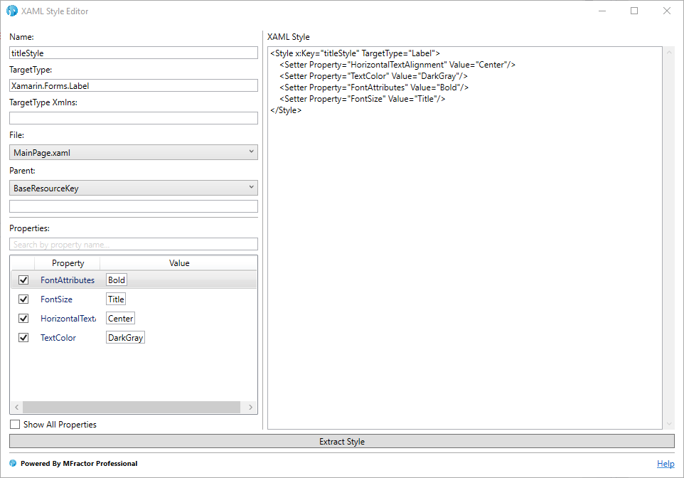
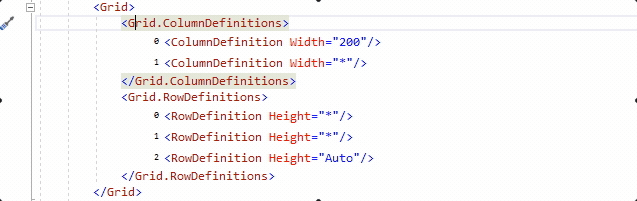
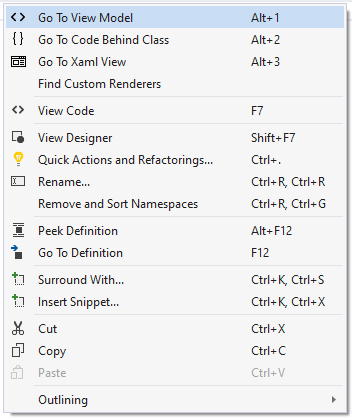
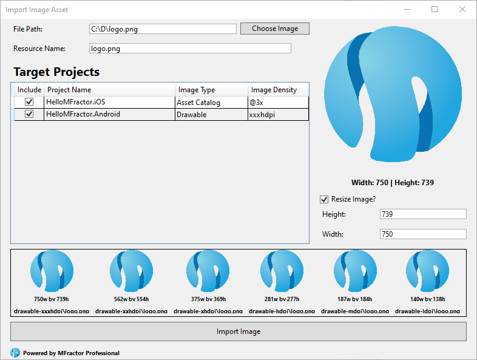

## Introduction

Sometime around the year 2016 Matthew Robins, a talented mobile developer, felt that Xamarin Studio, the main IDE for developing Xamarin apps on mac systems, was severely lacking productivty features for the mobile workflows. **MFractor**, a contraction of the _Mono Refactor_ name, has born to a few years later became one of the most powerful productivity toolbox for Xamarin and .NET developers.

On this post we'll get to know MFractor, what it is and how it can boost your productivity as a mobile developer for the Xamarin platform, by leveraging tools that you already used to with features carefuly thought for mobile developers.

## Powerful Tools For Xamarin.Forms Developers

Xamarin.Forms is a beloved by thousands of developers around the globe by its powerful cross-platform UI capabilities. Once being a tool for prototyping simple commercial apps, Forms has become a full-featured platform for mobile development. Powerful platforms demands powerful tooling, so we can extract the most with less effort.

This is the mindset that drove the features of MFractor for Xamarin.Forms developers. This tooling enhances your development experience by adding hundreds of Code Analysis and Code Actions for editing XAML files, shortcuts to navigate around your code, wizards for adding Fonts and Value Converters and tooltips and adornments to enhance your edit and Intellisense experience.

### Fix XAML Bugs Instantly

XAML is a powerful language for describing your UI. Yet, most its features are built on top XML and are "loosely" joint. This is the case of Resource Dictionaries, a feature that allow us to declare shared resources that are referenced by a string key. Sometimes though we may have typos that will only be found when the app crashes at runtime 🤯...

MFractor to the rescue! The static resource analysis will check every reference declaration to make sure it resolves to an item on the resource dictionary of that declaration scope. An error will be shown when MFractor identifies that a reference 

Notice that a very descriptive message is shown on the tooltip, but also, you have a few available fixes. MFractor is smart enought to figure if you may have done a typo, and suggest resources with similar names.

But notice also that the resource in question is a style, an important part of UI composition that gets special attention on MFractor. One of the available fixes allows you to easily create a new style from the element, enters the Extract Style feature, a Wizard that allows you to quickly extract properties of current element into a style to be placed on the current file or in the project-wide `App.xaml` dictionary.

The Extract XAML Style is a powerful tool to create styles from properties of existing elements. In the example above you can create a new style based on the properties of that Label. You can even change those properties or add new ones, and the right-pane preview allows you to check exactly what changes MFractor will make to your code.

Data-binding is a huge part of Forms development, and MFractor also keeps you covered. When writing a binding-expression, intellisense is enhanced to add all the properties available on the Binding Context:

Similar to Resources, Bindings are checked against the context to prevent errors that would only be catch at runtime, such as typos on the properties names:

It may be a simple typo and once again you can replace with the correct name, but notice you can also generate a new property with the name of the binding expression directly from the fixes on the tooltip. This is very effortless and time saving!

### Cleanup Your XAML

Designing your UI with XAML in one of the strongest(?!) features of Xamarin.Forms projects. Although being very powerful, XAML may become messy if we don't manage the dependencies. MFractor introduces several Code Analysis tools that helps you identifying how to simplify and cleanup your XAML code. 

Take for instance values that are declared repeatedly throughout the project, such as Thicknesses. With the thickness analysis MFractor constantly check all `Margin` and `Padding` property declarations to identify duplications. Green squiggles will be shown to indicate it, but the interesting part is hovering it, take a look at the tooltip:  

With just a click you can view all the usages of that thickness or consolidate all thickness declarations of the same value with a Static Resource, a nice and quick you to clean up your code!

As we said before, styles are first-class citizens to MFractor, for this reason we try to ease its usage with features like [Matching Style Analysis](https://docs.mfractor.com/xamarin-forms/working-with-styles/matching-style-analysis/#applying-a-matching-style), that constantly analyzes your elements against the declared styles to find a fit. Applying the matching style instantly simplifies the element declaration:

 
 
 A new feature brought recently to Xamarin.Forms is the simplified Grid Rows and Columns declaration. Your projects probably already have several Grid declarations with the traditional style. With a simple click you can convert your declarations to the new format:

Those are only a few examples of how MFractor can help you fix issues and clean-up your XAML code, but there's much, much more. Check out our feature matrix for [XAML Code Actions](https://docs.mfractor.com/feature-matrix/#xaml-code-actions) and [XAML Code Analysis](https://docs.mfractor.com/feature-matrix/#xaml-code-analysis), there are hundreds of checks and actions available.

### Ready for MVVM

The Model-View-ViewModel pattern is broadly used on Forms projects and MFractor make it really easy to work with it by adding handful features such as the MVVM Navigation, Wizard, Intellisense and several code actions.

When working with a View you can quickly switch between the XAML file, its code-behind and its View Model using keyboard shortcuts that can be easily be remembered:

MFractor uses common conventions to identify where each of these parts are. 

With the MVVM Wizard you can create a new View with its ViewModel while preview the output: 

But it's not just about the creation, but how you create them and in what places. The Wizards stands for lots of customization that allow you to adapt to any project convention.

## Image Management Simplified

Every modern and engaging app has several assets to compose its layouts. Adding images to projects is tedious and error prone. MFractor brings the Image Importer, a powerful tool that adds an image to all the required projects of your solution, giving it's correct names and resizing as required, freeing you from the complexity of dealing with densities and buckets.

Using the importer is as simple as browsing your image and clicking _Import Image_, most of the defaults will suffice for most projects. But importing is just the start! MFractor also 

Mobile developers have to leave coding from time to time to import and manage the assets of its product, a required yet time consuming and error prone task.  

Developers love coding, but its inevitable to deal with images in a Mobile project. MFractor strives to made image management simple and straightforward, so you can focus on your coding while integrate designers work into your project effortless. 

## Choose Your IDE

MFractor is available as an extension of Visual Studio for Windows and Mac with almost all features available in both platforms, being one of the first cross-platform productivity extension for developers. By unleashing the full power of the Professional edition, you can use a single license for either environments. 

## Summary

MFractor is an extension for Visual Studio that adds 200+ features to enhance your mobile development productivity. Check out our Feature Matrix to see everything that we can do for you.