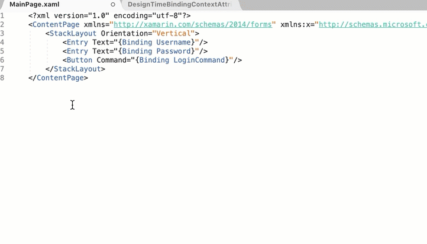

*An overview of working with Grids in Xamarin.Forms with MFractor*

## Introduction

Grids are one of the most powerful controls in Xamarin.Forms.

Using Grids, we build UIs that can adapt to different screen sizes and to create layering so we can place elements on top of one another (For example, a floating action button).

But, to quote Uncle Ben, with great power comes great responsibility 🕷

What is this responsibility you ask? Well, each grid we build needs to be maintained! Here are some examples of the maintenance issues with grids:

 * When we add a new row or column, we often need to adjust several other elements. A single change in a grid can mean we need retest our entire UI to make sure it still works correctly and we haven't introduced any new bugs.
 * We position views in a grid through a zero-based row or column index. Computers love numbers but humans love names, zero-based index locations aren't intuitive for us to use.

Over the years, I've built many features in MFractor to make working with Grids considerably easier. This article aims to distill some of my insights, help you understand *why* these tools came to be in MFractor and *how* they can make your Xamarin development a little easier.

I love grids to death but they can be an utter headache to maintain. Luckily, with some foresight and the right tools, they don't have to be!

## Start With A StackLayout

Counter-intuitively, I recommend that you start with a `StackLayout` when building a new user interface. Unless you need both rows and columns straight away, choosing a StackLayout is, in my experience, more preferable.

I advise this because StackLayouts are considerably easier to build and maintain. They automatically layout elements vertically (rows) or horizontally (columns) and do not need additional code like `Grid.Row`/`Grid.Column` to designate where an element should appear. Less code == less bugs.

The main concern I encounter when I recommend this is performance. Yes, Grids are technically more performant, but the difference is marginal. Frankly, from my 8 years of Xamarin development experience, performance usually stems from bad algorithm design, excessive memory usage, poor data-base queries or poor use of parallelism. Rarely has it been from using a StackLayout over a Grid.

We should be concerned with building the app first and foremost and worry about performance **if and when** we encounter issues. Speed to market and delivering features for our customers are more important than premature optimisation.

**Be pragmatic not pedantic.**

StackLayouts, therefore, are initially more preferable. They let us deliver faster and give us greater flexibility to iterate on our user interfaces.

However, there does come a time when you will need to change from a StackLayout to a Grid. For example, you need to start defining horizontal columns in addition to rows.

To make this conversion dead easy, I built the **Convert StackLayout To Grid** refactoring that, well, converts a stack layout to a grid!

Consider a login form:

```
<StackLayout Orientation="Vertical">
    <Entry Text="{Binding Username}"/>
    <Entry Text="{Binding Password}"/>
    <Button Command="{Binding LoginCommand}"/>
</StackLayout>
```

It's Grid equivalent is:

```
<Grid>
   <Grid.RowDefinitions>
      <RowDefinition Height="Auto"/>
      <RowDefinition Height="Auto"/>
      <RowDefinition Height="Auto"/>
   </Grid.RowDefinitions>
    <Entry Grid.Row="0" Text="{Binding Username}"/>
    <Entry Grid.Row="1" Text="{Binding Password}"/>
    <Button Grid.Row="2" Command="{Binding LoginCommand}"/>
</Grid>
```

To convert your StackLayout to a grid:

 * **Mac**: Right click on a stack layout and go to **MFractor Code Actions** then choose **Convert Stack Layout To Grid**.
 * **Windows**: Press `Alt+Enter` on a stack layout and choose **Convert Stack Layout To Grid**.

This refactoring will create rows if the StackLayout is vertical or columns if the StackLayout is horizontal, adding the appropriate `Grid.Row` or `Grid.Column` property to each element and decide to use `*` when the layout options use `AndExpand` or `Auto` by default.



## Tracking Row/Column Locations

After we have declared a grid, it is likely that we want to document the intended usage of each row or column and provide an easy way for developers to understand our grids layout.

Over the years I have used and seen others use the following code to annotate the intended behaviour of a row/column:

```
 <RowDefinition Height="Auto"/> <!-- Index: 1 - Password Entry Row -->
```

While I love this as it documents the code, it introduces a problem. We now need to maintain the `Index: 1` part of the comment to always refer to the index element. If we ever change this rows index, we run the risk of the comment becoming stale.

[Covered in last weeks blog](https://www.mfractor.com/blogs/news/introducing-grid-index-and-color-xaml-adornments), MFractor injects *grid index adornments* into the XAML editor to visually show the index for a given row or column. This removes the need to maintain a list of indices as the tooling now immediately shows you them.


These annotations enable us to look at the definitions and instantly see the index for a given row or column.

## Using x:Name To Describe The Row/Column

Grid adornments are useful as they show us the row/columns precise location in the grid. However, they don't *describe* the intention for a particular row or column in a grid.

To describe what a row or column does, we can apply the `x:Name` attribute with a short, descriptive name of the element:

`<RowDefinition x:Name="passwordRow" Height="Auto"/>`

This clearly documents the indented usage of the row, making it easier for future developers to understand our code.

Applying `x:Name`'s to your rows and columns will also activate several MFracotr features.

If you have applied an x:Name to your row or column definition, you can simply type the name of that row/column and MFractors code completion will insert the grid location:


In addition, you can also hover over a `Grid.Row` or `Grid.Column` property on a View and verify that it is in the right location:


## Updating Row And Columns

Lastly, it is inevitable that we will need to update our grid and either add or remove a row or column from it.

This is a painful process; we need to insert our row/column, figure out the new index and then go update each view to the new index. This is tedious and error-prone!

To speed this up, MFractor includes three refactorings:

 * Insert row/column before.
 * Insert row/column after.
 * Delete row/column.

Here is an example of these refactorings in use:


This refactoring is very useful as we can now insert or remove rows and column and MFractor automatically updates the indexes and spans for us.

## Summary

In this article we have covered the various tools in MFractor that assist in working with grids.

We can use adornments to track the index of rows/columns, leverage MFractors code completion to quickly insert new elements and easily insert or delete rows and columns.

Like MFractor and want to see more killer tools for Xamarin developers? [Purchase an MFractor license](https://www.mfractor.com/buy) and support us in developing more productivity tools.

😊🤙
Matthew Robbins - Founder of www.mfractor.com
