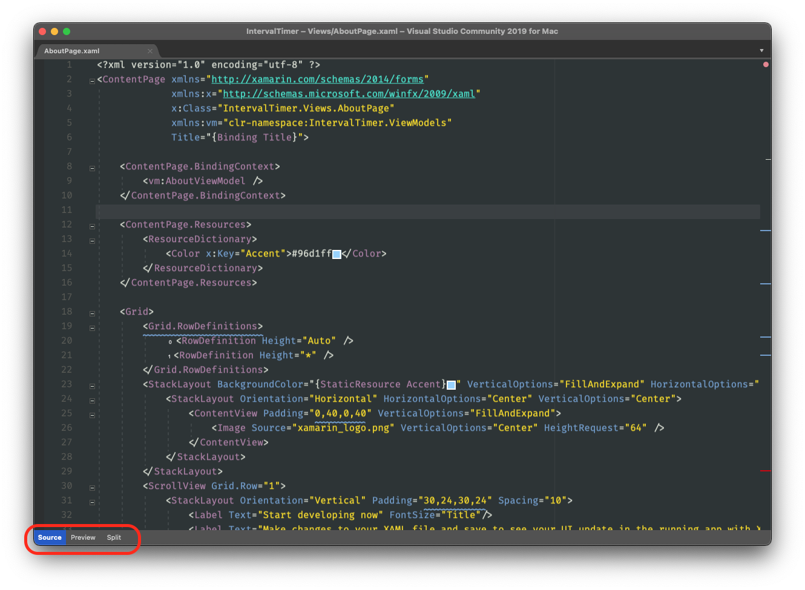
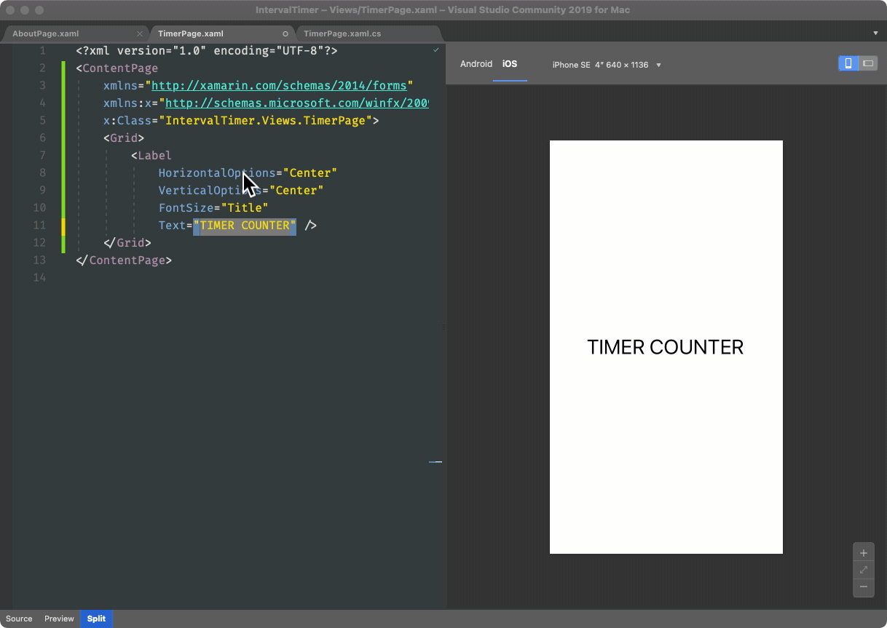
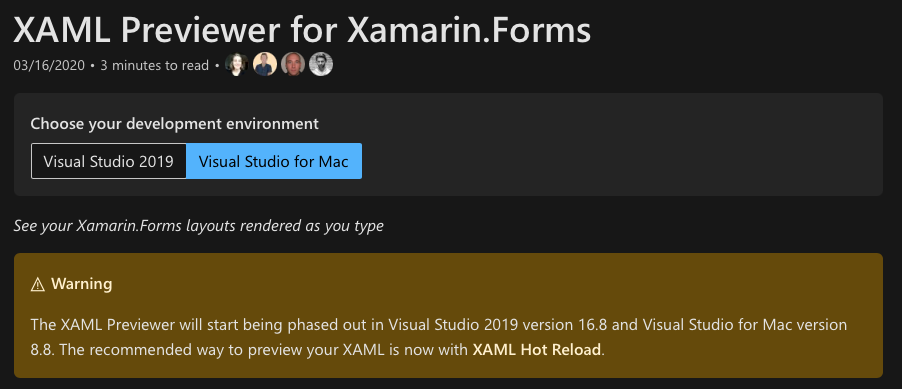

# XAML Previewer and Hot Reload

Last year apple presented Swift UI, their new user interface composition framework that overtime should replace UI Kit for iOS. I found some people surprised by their Previewer tool, which is in fact pretty awesome, but people tend to forget what they already have on their side. XAML Previewer is one of those tools that has been there for a while and most people forgot about. Yeah, its true they were problematic on their first iterations, but it got pretty decent over-time.

Now a hot new feature (no pun intended) is the Hot Reload. While the Previewer is fine basic work, the Hot Reload is a really 

Designing UI's for mobile apps has always been a hard task. XAML is a excelent language for describing user interfaces, but it still falls short of tooling like we used to have with WPF (although I personally never meet programmers who really preferred )

## Introduction

Outline challenges of building mobile UIs and the need to visually see our changes.

Brief description of hot reload and Previewer.

Visual Studio brings a couple of tools to assist on writing your UI code, the Previwer and more recently Hot Reload. 

Hot reload -> make a change and see it on a physical device.
Previewer - A design-time, in editor tool to preview the rendering of our UIs.

## Previewer

The XAML Previewer is a built-in tool in Visual Studio that shows a real-time representation of the XAML content that you're working on your main editor. It was the first integrated tool to aid developer on designing Xamarin.Forms Pages and Views.

The Previewer is available while editing XAML files. To use it just open a XAML file and on the bottom tab switch between **Preview** or **Split** views:

While in split mode, you can choose to preview for iOS and Android, and change between some device screen sizes and orientations. Then you can edit your code to have its preview updated in real time:

The Previewer is a fine tool and it's been serving us well for some years, but now it's officially beeing phased out (check out the warning on its [documentation page](https://docs.microsoft.com/en-us/xamarin/xamarin-forms/xaml/xaml-previewer/?pivots=macos)) in favor the XAML Hot Reload.

## Hot Reload

XAML Hot Reload was recently introduced on the toolbox of Xamarin.Forms developers. It could be considered like a "spiritual successor" of the Previewer, in the sense that it tries to solve a similar pain, but in a totally different way.

Most developers like to write their stuff and run on simulators or devices to check the results. While a Previewer is useful, it puts the subject (the View you're working on) out of the context of the whole application. Testing the real thing is always better, but build and deployment times are high, specially on large and complex projects.

Hot Reload builds on top of this workflow by allowing the developer to change Views "on the fly", making the running app an actual full-fledged Previewer. Better yet, it works for physical devices, which is the ultimate testing ground.

### Using Hot Reload

If you've updated to the latest versions of Visual Studio and is working on new projects, Hot Reload is mostly "there". Let's give it a try! Open Visual Studio and create a new Shell Xamarin.Forms project. I will call it **HotReloadDemo**. After creation just run the app on the simulator.

> I've chosen the Blank App template because the others have too much boilerplate. 

> **Note**: I wasn't intented to do a pixel-perfect re-creation of Interval Timer UI, but just use it as base for experimenting on designing with Hot Reload.

For this demo I want to re-create the main screen of the **Interval Timer** app, a very nice Stopwatch for HIIT workouts with an compelling yet easy to re-create visual.

The Visual Studio template for the Shell Project opens up on the _About_ page, that is represented by the file `Views/AboutPage.xaml`. Open up the file and make some changes, like 

Its a productivity tool targeted to aid on composing the visuals of an app. It builds on top of the development workflow of changing some stuff, deploying and testing. 

The new tool builds on top of the common development workflow of "changing some stuff, compiling and running the whole project and test for the small change". 

While the Previewer was an integrated tool, Hot Reload allows you make changes on running instaces of the app on simulators or physical devices. 

 This overcomes some limitations of the Previewer that needed to be feed with design-time data, and 

With this new tool we are able to make changes on a XAML file and have it re-deployed in real time to a running instance of the app. 

While the previewer was convenient, it kinda buggy and have some issues and limitations when dealing 

What is it?

Hot Reload is a nice feature that allows changes to a XAML source to be applied to the running app in either the simulator or on a real device. 

It's very useful when composing a Page or View, because it allows 

Why is it useful?

How do I use it?
It's strengths?
It's limitation?
Any license limitations?

## Summary

XAML Previewer and XAML Hot Reload are tools for aiding on the complex task of creating UI's on Xamarin.Forms project. The former was introduced in the early years of the framework and had several issues and limitations that paved the way for the modern Hot Reload feature.

I personally feel sad about the deprecation of the Previewer, even though the modern tool being more powerful, using the Previewer was convenient. I supose that this deprecation has to do with upcoming changes to the Xamarin platform (MAUI), that will make support the Previewer much complicated, so its understable.