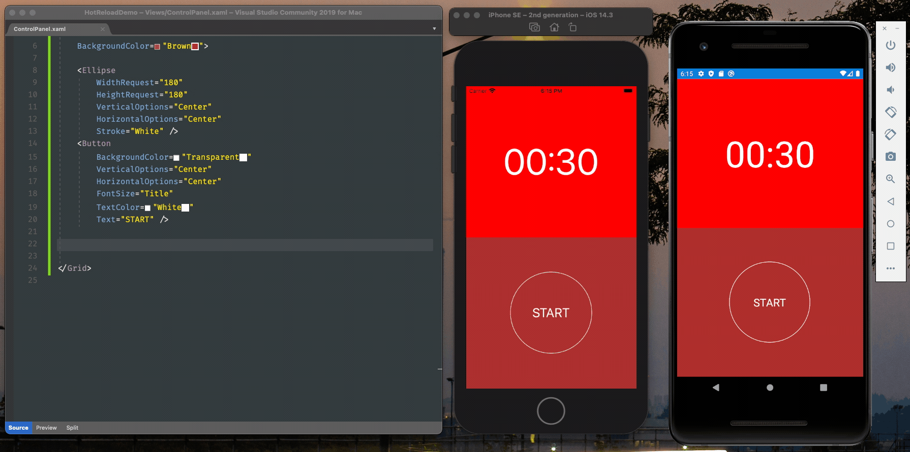

# XAML Hot Reload and Previewer

Building UI's has always been a hard job. Modern apps tends to use complex designs and need to adapt to the growing number of device sizes and form-factors. The most established front-end development workflows are based on transcribing designs based on static images to the components that actually render that screen at runtime.

For the Xamarin.Forms developers, UI's are written entirely in code, either through XAML or C#. This allows developers to have full control over the rendering of the interface and split it into reusable components, but comes with drawbacks.

Its hard to write UI code without seeing its actual output. Drawing UI from an application framework is not like composing it on a tool like Photoshop by drawing and styling primites (although its possible through shapes). As developers we think of UI elements as dynamic components and interactive components.

Writing a complex UI is for the most part a trial and error exercise and  commonly you would need to do several roundtrips between edits to test every dynamic and interact aspect of the interface. Lucky us Xamarin.Forms, we have some great tools to facilitate this jobs:

* [**XAML Hot Reload**](): allows us to make changes to change XAML code and have it updated on a running instance of your app, either on a simulator or a real device.
* [**XAML Previewer**](): is a tool built to Visual Studio XAML editor, that allows us to have instant insight on the UI that you're working.

Let's take a deep look on them!

## XAML Hot Reload

The XAML Hot Reload feature is a recent addition on the Xamarin.Forms developers toolbox. It allows developers to enhance the common workflow of editing a file and testing it on a simulator or device, which is definately the best way of testing your work.

Hot Reload allows us to avoid the expensive roundtrip of building and deploying the app. Changes made to XAML files are instantly updated on the running instance, which in practice makes the simulator a kind of real-time previewer.

### Using Hot Reload

If you've updated to the latest versions of Visual Studio and is working on new projects, Hot Reload is mostly "there". Let's give it a try! Open Visual Studio and create a new Blank Xamarin.Forms project. I'll call it **HotReloadDemo**. After creation just run the app on the simulator.


This is the design of the `MainPage.xml` from the Blank project template. Open the file on the editor while you keep the debugger running and let's change the header to a red background. Save the file and see the "magic":


After saving the file the page was refreshed with the changes you've made. You can keep doing changes to this file, and when you're happy with them just save it to have it deployed instantly to the running app. Let's try to change the entire page layout, replace the inner of the `ContentPage` element with the following:

```xml
<Grid RowDefinitions="*,*" RowSpacing="0">
    <!-- Top half - The chronometer -->
    <BoxView Color="Red" />
    <Label
        VerticalOptions="Center"
        HorizontalOptions="Center"
        FontSize="80"
        TextColor="White"
        Text="01:30" />

    <!-- Bottom half - The controls -->
    <BoxView
        Grid.Row="1"
        Color="Brown" />
    <Ellipse
        Grid.Row="1"
        WidthRequest="180"
        HeightRequest="180"
        VerticalOptions="Center"
        HorizontalOptions="Center"
        Stroke="White" />
    <Button
        Grid.Row="1"
        VerticalOptions="Center"
        HorizontalOptions="Center"
        FontSize="Title"
        TextColor="White" 
        Text="START" />
</Grid>
```

This is a roughly and incomplete re-creation of the [Interval Timer](https://apps.apple.com/us/app/interval-timer-hiit-workouts/id406473568#?platform=iphone) app main screen. It's not meant to be perfect, just to give us an entire new interface. Please be mercyful with my design skills... 🙂

So, when you save the file, you should see that after a flash the whole content of the screen will be replaced with no damage to the running app. 


You can keep doing this until you're satisfied, then you get to your next design subject. Hot Reload is smart enough to identify custom views and keep them updated as you edit, which allows for example to change the layout of a Collection View cell on it's own cell file and having it updated on the running app.

In the following example I've created a custom view to represent the control panel on the bottom of the screen (file `Views/ControlPanel.xml`):

```xml
<Grid
    xmlns="http://xamarin.com/schemas/2014/forms"
    xmlns:x="http://schemas.microsoft.com/winfx/2009/xaml"
    x:Class="HotReloadDemo.Views.ControlPanel"
    BackgroundColor="Brown">

    <Ellipse
        WidthRequest="180"
        HeightRequest="180"
        VerticalOptions="Center"
        HorizontalOptions="Center"
        Stroke="White" />
    <Button
        BackgroundColor="Transparent"
        VerticalOptions="Center"
        HorizontalOptions="Center"
        FontSize="Title"
        TextColor="White" 
        Text="START" />
    
</Grid>
```

Then added it to the main page:

```xml
<Grid RowDefinitions="*,*" RowSpacing="0">
    <!-- Top half -->
    <BoxView Color="Red" />
    <Label
        VerticalOptions="Center"
        HorizontalOptions="Center"
        FontSize="80"
        TextColor="White"
        Text="00:30" />
    <!-- Bottom half component -->
    <views:ControlPanel Grid.Row="1" />
</Grid>
```

Try changing something on the nested view and see it being propagated to the simulator!


>**Note:** I've kept the code for the views as simple as possible to focus on previewer experience. It by no means represent real production code that I would add to a project.

By default, Hot Reload will refresh the entire page no matter how simple is the change. There's a feature **currently in preview** to refresh only the changed view. You can set it on the Visual Studio Preferences:


Finally, Hot Reload can be used on iOS and Android projects simultaneously. Create a run configuration to start both projects on debug, now you can put the iOS simulator and the Android emulator side-by-side and review how your changes apply on both platforms:



In the example above I've added the code for a Stop button to the right of the panel. Here's the code:

```xml
<Grid
    WidthRequest="80"
    HeightRequest="80"
    VerticalOptions="Center"
    HorizontalOptions="End">
    <Ellipse
        Stroke="White" />
    <Button
        VerticalOptions="Center"
        HorizontalOptions="Center"
        BackgroundColor="Transparent"
        TextColor="White"
        Text="Stop" />
</Grid>
```

>Notice we're using the `Ellipse` View from Shapes feature of Xamarin.Forms 5. We'll be covering it in a future post.

XAML Hot Reload is available on Visual Studio for Mac and Windows starting on the free community tier. Actually its not tied only to Visual Studio as is much more a compiler/debugger feature, making it available on JetBrains Rider too.

## Previewer

The XAML Previewer is a built-in tool in Visual Studio that shows a real-time representation of the XAML content that you're working on your main editor. It was the first integrated tool to aid developer on designing Xamarin.Forms Pages and Views.

The Previewer is available while editing XAML files. To use it just open a XAML file and on the bottom tab switch between **Preview** or **Split** views:


While in split mode, you can choose to preview for iOS and Android, and change between some device screen sizes and orientations. Then you can edit your code to have its preview updated in real time:


The Previewer is a fine tool and it's been serving us well for some years, but now it's officially beeing phased out (check out the warning on its [documentation page](https://docs.microsoft.com/en-us/xamarin/xamarin-forms/xaml/xaml-previewer/?pivots=macos)) in favor the XAML Hot Reload. 


Visual Studio is already suggesting using Hot Reload instead of the Previewer:


## Summary

